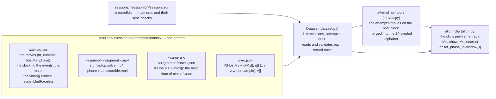

# 01 · The recordings: what comes in

[← The pipeline](README.md) · next: [02 · The dataset tooling](02-dataset.md)

The capture app ([shermam/cubetrace](https://github.com/shermam/cubetrace); its `docs/DATA-MODEL.md` is
the reference for every field) writes one folder per attempt. This page says what is in those folders,
how this repository reads them (`store`, `records`, `dataset`), and the three things every later stage
relies on: **the clocks** (how a move gets its time), **the lag** (how a camera's frames relate to the
cube's time) and **the alphabet** (the 24 symbols the model predicts). It ends with the **per-frame
track**, the first derived object: one row per video frame with the nearest move and the cube's orientation
(`align`).



| | In | Out |
|---|---|---|
| **This page's code** | the JSON (JavaScript Object Notation) records and the MP4 video files under a dataset root (a local folder, or `gs://cubetrace-data/users/<uid>`) | `Dataset` (the records as Python dicts, validated), `Symbol` lists (the moves on one clock, in the alphabet) and `ClipAlignment` (the per-frame track of a clip) |

## The files

A **session** is one run of the app at the rig (hours, sometimes more than a day: 4 to 44 hours on the
records; tens to hundreds of attempts). An **attempt** is one
scramble followed by one solve. A **clip** is one camera's recording of one **segment** of an attempt, the
`scramble` or the `solve`; an attempt with two cameras has four clips.

**`attempt.json`** carries everything the cube said and everything the app decided:

- `moves[]`: every quarter turn the cube reported, as `{"m": "R'", "cubeMs": …, "hostMs": …, "phase":
  "solve"}`. `m` is the turn in standard cube notation (a face letter, `'` for counter-clockwise), `cubeMs`
  the time on the cube's own clock, `hostMs` the time the Bluetooth packet reached the laptop or phone,
  `phase` whether it belongs to the scramble or the solve.
- `clock`: `{a, b, residualP95Ms}`, the attempt's **clock fit** (below).
- `events`: `scrambleShown`, `scrambleStart`, `scrambleDone`, `solveStart`, `solveEnd`, …, host times.
- `result`: `status` (`solved` or `dnf`, "did not finish"), `replayOk` (whether the reported solve moves,
  replayed on a simulator from the scrambled state, reach the solved state: a check that no move went
  unseen), `tps` (turns per second), `timeMs`.
- `video[]`: one entry per clip: `camera` (`laptop`, `phone-rear`, …), `segment`, `file`, `framesFile`,
  `frames`, `bytes`, `width`, `height`, `fpsNominal`, `crop` (the framing rectangle the owner set in the
  app, on the laptop only), `syncResidualMs` (the camera's **lag**, below; null without a sync check),
  `firstFrameHostMs`, `truncatedStart`.
- `gyro`: `{file, samples, rateHz}`, the orientation file's summary; `scrambledFacelets`: the cube's state
  after the scramble (54 letters), which the replay metric starts from (page 08); `app`: the build that
  wrote the record.

**`<camera>.<segment>.frames.json`** gives the host time of every frame of the clip: `t0HostMs` and the
list `dtMs` of gaps, so that frame `k` is at `t0HostMs + dtMs[0] + … + dtMs[k]` (`dtMs[0]` is 0). This is
what ties a video frame to the cube's timeline; the MP4's own timestamps agree with it to 0.01 ms, which
`check-alignment` verifies (page 02).

**`gyro.json`** is the cube's orientation sensor: `t0HostMs` and `dtMs` as above (about 12–14 samples a
second), `q` as a flat list of 4 numbers per sample (a unit quaternion `x y z w`; page 09 explains
quaternions) and `v` the angular velocity (3 numbers per sample, or null).

**`session.json`** holds `createdMs` (which decides the session's day, and so its split) and the cameras
with their sync checks.

Every record is validated against the app's [JSON Schemas](https://json-schema.org/) (a schema is a
machine-readable contract for a JSON document: required fields, types, ranges), vendored under
`schemas/` with the app commit they came from, through the
[`jsonschema`](https://python-jsonschema.readthedocs.io/) library (`records.check`). A record that does not
match stops the read with a `RecordError` that names the first mismatch as a JSON pointer:

```python
def check(kind: str, doc: Any, where: str = "") -> Any:
    """`doc` itself when it matches the schema of `kind`; a `RecordError` otherwise."""
    found = errors(kind, doc)
    if found:
        raise RecordError(kind, where or kind, found)
    return doc
```

## Reading the files: `store`, `dataset`

The code never assumes where the files are. `store.Store` is a four-method interface (`listdir`,
`read_bytes`, `local_path`, `size`) with two implementations: `LocalStore` over a folder and `GcsStore`
over a `gs://` prefix of [Google Cloud Storage](https://cloud.google.com/storage/docs) through the
[`google-cloud-storage`](https://cloud.google.com/python/docs/reference/storage/latest) client. The bucket
store lists the prefix once, then reads every file through an on-disk cache stamped with the object's
**generation** (the bucket's version number of an object), so a file is downloaded again only when it
changed; an MP4 is downloaded only when a command needs its video. The bucket is read with
[Application Default Credentials](https://cloud.google.com/docs/authentication/application-default-credentials)
by the coordinator only; agents and tests use local folders.

```python
def open_store(root: str | Path, *, cache_dir=None, client=None) -> Store:
    """The store of a dataset root: a `gs://bucket/prefix` URL or a local folder."""
    text = str(root)
    if text.startswith("gs://"):
        return GcsStore(text, cache_dir=cache_dir, client=client)
    return LocalStore(text)
```

`dataset.Dataset` is the one object every command starts from (`--root`, or the environment variable
`CUBETRACE_DATA`). It lists sessions, the attempts of a session (the numbered folders that hold an
`attempt.json`) and the clips of an attempt (one `ClipRef` per entry of `video[]`), and reads each record
once, validating it unless `--no-validate`:

```python
@dataclass(frozen=True, order=True)
class ClipRef:
    """One clip: a camera's recording of one segment of one attempt."""
    session: str
    attempt: int
    camera: str
    segment: str

class Dataset:
    def sessions(self) -> list[str]: ...
    def attempts(self, session: str) -> list[int]: ...
    def clips(self, session: str | None = None) -> Iterator[ClipRef]: ...
    def attempt(self, session: str, index: int) -> dict[str, Any]: ...   # attempt.json
    def frames(self, clip: ClipRef) -> dict[str, Any]: ...               # the clip's frames.json
    def gyro(self, session: str, index: int) -> dict[str, Any] | None: ...
    def video_path(self, clip: ClipRef) -> Path: ...                     # a local path to the MP4
    def session_day(self, session: str) -> tuple[str | None, bool]: ...  # YYYY-MM-DD (UTC)
```

## The clocks: how a move gets its time

Two clocks are involved. The cube stamps each turn on its own clock (`cubeMs`); the host stamps the
packet's arrival on its clock (`hostMs`). The arrival is late and jittery: Bluetooth delivers packets in
bursts, so `hostMs` wobbles by 14–34 ms (the 95th percentile of the residuals, `clock.residualP95Ms`) around
the true time. The cube's clock is steady but runs at its own rate (0.7% slow on the capture app's first real recordings, its issue #22) and starts at an arbitrary zero.

The app fits a straight line between the two clocks over the attempt, the ordinary least-squares line
(the simplest "model" in this pipeline: two parameters, fitted by minimizing squared error, the same idea
that every later stage scales up):

$$t_{\text{host}} = a \cdot t_{\text{cube}} + b$$

With the line, a move's time on the host clock is the cube's own timing without the jitter. `moves.move_times`
applies it when it is sane (`fit_usable`: a slope between 0.9 and 1.1 and a `residualP95Ms` of at most
250 ms) and the move is on that line (within 250 ms of its arrival); otherwise the move keeps its
`hostMs`. This is the default time base, `fit`; `--time-base arrival` uses `hostMs` throughout.

```python
def move_times(attempt: dict[str, Any], time_base: str = "fit") -> tuple[np.ndarray, np.ndarray]:
    """Each move's time on the host clock and whether the attempt's fit placed it."""
    moves = attempt["moves"]
    host = np.array([m["hostMs"] for m in moves], dtype=np.float64)
    clock = attempt.get("clock")
    if time_base == "arrival" or not fit_usable(clock):
        return host, np.zeros(len(moves), dtype=bool)
    cube = np.array([m["cubeMs"] for m in moves], dtype=np.float64)
    fitted = clock["a"] * cube + clock["b"]
    on_fit = np.abs(fitted - host) <= FIT_TOLERANCE_MS
    return np.where(on_fit, fitted, host), on_fit
```

The events that are moves (`scrambleStart` is the first scramble move's arrival, `solveEnd` the last
solve move's, and so on) take their move's fitted time (`align.event_times`), so the segment windows sit
on the same clock as the moves.

## The lag: where a camera's frames sit on that clock

A camera's frame at host time `tMs` shows the world as it was a little earlier: the sensor's exposure,
the encoder and the pipeline between them add a delay. The app measures it per camera with a
clapperboard-like sync check (a turn seen by the cube and by the camera at once) and writes it to each clip
as `syncResidualMs`. The rule used everywhere downstream (`align.py`):

- a move whose time is `onset` appears in the clip's frames at **`onset + lag`**;
- the frame at `tMs` shows the cube as it was at **`shownMs = tMs − lag`**.

A clip whose camera had no sync check has `syncResidualMs` null: it is **unsynced**, its lag is taken as
0, and the manifest flags it (the phones' clips, until the phone ran its own check). The lags measured so
far are 53–430 ms, so ignoring them would misplace a move by several frames.

## The window and the phases

A clip's **window** is its segment's span on the cube's timeline: `scrambleStart` to `scrambleDone` for
a scramble clip, `solveStart` to `solveEnd` for a solve clip (`segment_window`; no end for a DNF). The
clips begin a few seconds before their window and end about a second after it. Each frame also gets the
attempt's **phase** at `shownMs` (`phase_codes`): `before`, `scramble`, `inspection` (from the last scramble move to the first solve move), `solve`, `after`.

## The alphabet: the 24 symbols

The cube reports quarter turns only. A double turn (`R2`) arrives as two `R` a few tens of milliseconds
apart; a slice move (`M`, the middle layer) arrives as the two outer faces turning the same physical way at the same instant (`R` and `L'`: opposite in
notation, since each turn is named as seen from its own face), because the cube senses faces, not layers. The model predicts the **merged**
symbol, which is what a human would write, so the move stream is normalized first (`moves.normalize`,
the same rule as the owner's simulator `ferramentas/cubo.py`): scanning from the left, two opposite faces
turning the same physical way less than 20 ms apart are a slice; two equal quarter turns of one face less
than 200 ms apart are a double; anything else is itself. Two turns of different phases never merge.

```python
def normalize(names, times, phases=None, *, slice_ms=SLICE_MS, double_ms=DOUBLE_MS) -> list[Symbol]:
    parsed = [parse_move(m) for m in names]
    out: list[Symbol] = []
    i = 0
    while i < len(parsed):
        face, turns = parsed[i]
        t = float(times[i])
        phase = phases[i] if phases is not None else ""
        if i + 1 < len(parsed) and (phases is None or phases[i + 1] == phase):
            other, other_turns = parsed[i + 1]
            u = float(times[i + 1])
            gap = u - t
            if other == OPPOSITE[face] and other_turns == 4 - turns and turns != 2 and gap < slice_ms:
                out.append(Symbol(SLICES.get((face, turns)) or SLICES[(other, other_turns)], t, u, phase, i, 2))
                i += 2
                continue
            if other == face and other_turns == turns and turns != 2 and gap < double_ms:
                out.append(Symbol(face + "2", t, u, phase, i, 2))
                i += 2
                continue
        out.append(Symbol(face + SUFFIX[turns], t, t, phase, i, 1))
        i += 1
    return out
```

The result is a list of `Symbol` (the symbol, its **onset** = its first turn's time, its end, its phase,
and which raw moves it merged). The 24 symbols have fixed indices, which become the model's **class ids**
(page 04 adds 1 to each, keeping 0 for "no onset"):

| Index | Symbols | | Index | Symbols |
|---|---|---|---|---|
| 0–2 | `U` `U'` `U2` | | 9–11 | `D` `D'` `D2` |
| 3–5 | `R` `R'` `R2` | | 12–14 | `L` `L'` `L2` |
| 6–8 | `F` `F'` `F2` | | 15–17 | `B` `B'` `B2` |
| | | | 18–23 | `M` `M'` `S` `S'` `E` `E'` |

(`U` up, `R` right, `F` front, `D` down, `L` left, `B` back, each clockwise as seen from that face; `'`
counter-clockwise; `2` a half turn; `M`, `S`, `E` the three middle slices. The
[World Cube Association notation](https://www.worldcubeassociation.org/regulations/#12a) is the reference.)

## The per-frame track: `align_clip`

`align.align_clip(attempt, frames, gyro)` is the join of everything above for one clip, computed from the
JSON alone (no video decoded): a [NumPy structured array](https://numpy.org/doc/stable/user/basics.rec.html)
with one row per frame.

| Field | Meaning |
|---|---|
| `frame` | the frame's index in the clip |
| `tMs` | its host time, `t0HostMs` + cumulative `dtMs` |
| `shownMs` | `tMs − lag` (`tMs` when unsynced): the moment it shows |
| `symbol`, `onset` | the alphabet index of the nearest onset (among all the attempt's symbols, on the frames' timeline) and that onset's position in the attempt's symbols; −1 without moves |
| `distanceMs` | `tMs − (onset + lag)`: negative before the onset |
| `phase` | the attempt's phase at `shownMs` (0 before … 4 after) |
| `inWindow` | `shownMs` inside the segment's window |
| `qx` `qy` `qz` `qw` | the cube's orientation at `shownMs`, interpolated between the two gyro samples around it (slerp, page 09); NaN (not a number) without `gyro.json` |

```python
t = frame_times(frames)                       # t0HostMs + cumsum(dtMs)
shown = t - lag
low, high = segment_window(events, segment)   # the segment's span on the cube's clock
onsets = np.array([s.onset_ms for s in symbols]) + lag
nearest = nearest_onsets(t, onsets)           # for each frame, the index of the nearest onset
track["symbol"] = ...[nearest]                # its alphabet index
track["distanceMs"] = t - onsets[nearest]
track["phase"] = phase_codes(shown, events)
track["inWindow"] = (shown >= low) & (shown <= high)
```

The track is the common ground of the manifest's counts (page 02), the features' time arrays (page 03)
and the labels (page 04). `ClipAlignment.covered()` says how many of the segment's onsets fall inside the
clip's frames, which the filter uses.

## External tools on this page

| Tool | Why | Docs |
|---|---|---|
| NumPy | every array on every page: vectorized arithmetic in C, the lingua franca of Python's machine-learning (ML) stack | [numpy.org/doc](https://numpy.org/doc/stable/) |
| jsonschema | validates each record against the app's JSON Schemas | [python-jsonschema](https://python-jsonschema.readthedocs.io/) |
| google-cloud-storage | reads the bucket (`gs://` roots), optional extra `gcs` | [reference](https://cloud.google.com/python/docs/reference/storage/latest) |

## Where in the code

| Concept | Module | Functions and classes |
|---|---|---|
| where the files are | `store.py` | `Store`, `LocalStore`, `GcsStore`, `open_store`, `parse_gs_url` |
| the schemas | `records.py` | `schema`, `errors`, `check`, `RecordError` |
| listing and reading | `dataset.py` | `Dataset`, `ClipRef`, `utc_day` |
| the clock fit, the alphabet | `moves.py` | `move_times`, `fit_usable`, `normalize`, `attempt_symbols`, `Symbol`, `alphabet`, `SYMBOLS` |
| the track, the lag, the window | `align.py` | `align_clip`, `ClipAlignment`, `frame_times`, `event_times`, `segment_window`, `phase_codes`, `nearest_onsets`, `TRACK_DTYPE` |
