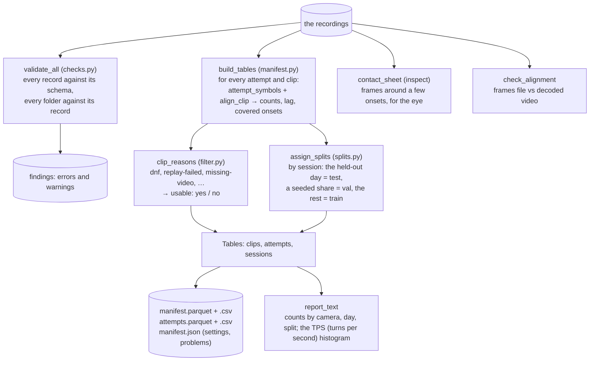

# 02 · The dataset tooling: validate, filter, split, manifest

[← 01 · The recordings](01-recordings.md) · [The pipeline](README.md) · next: [03 · Feature extraction](03-features.md)

Stage 1 answers four questions before any learning happens: *are the records sound?* (`validate`), *which
clips can be trained on?* (the consistency filter), *which clips are train, val and test?* (the splits) and
*how much do we have?* (the manifest and the report). None of it needs a GPU (graphics processing unit); most of it does not even
decode video. The output that the later stages read is one table, the **manifest**: one row per clip.



| | In | Out |
|---|---|---|
| `cubetrace-ml validate` | the recordings | findings on stdout (errors and warnings), exit 1 on errors |
| `cubetrace-ml manifest --out <folder>` | the recordings (+ `--video none/fast/full`, `--seed`, `--held-out-day`, `--val-fraction`) | `manifest.parquet`, `manifest.csv`, `attempts.parquet`, `attempts.csv`, `manifest.json` |
| `cubetrace-ml report` / `splits` | the recordings | a text report / each session's split |
| `cubetrace-ml inspect`, `check-alignment` | one clip / a selection of clips | a PNG (Portable Network Graphics) image, the contact sheet / a line per clip |

## Validation: `validate_all`

`checks.validate_all` walks every session and attempt folder and emits `Finding`s with a level (`error`
or `warning`), a path and a message: a record that fails its schema, an `attempt.json` whose `session` or
`index` is not its folder's, an MP4 video file whose size is not the record's `bytes`, a frames file whose count or
first time disagrees with the record, a `gyro.json` whose sample count is not its summary's, a file no
record names (a warning). It is the sanity gate a data engineer would run before trusting a batch.

```python
if (size := dataset.store.size(path)) != entry["bytes"]:
    findings.append(Finding("error", path, f"{size} bytes, the record says {entry['bytes']}"))
```

On the agents' mirror (9 attempts, 3 sessions): 44 records, 0 errors, 1 warning (a session folder without
`session.json`).

## The manifest: `build_tables`

`manifest.build_tables(dataset, …)` reads every attempt once and produces three tables as
[polars](https://docs.pola.rs/) DataFrames (polars is a fast, typed dataframe library; it is used instead of
pandas because it reads and writes [Apache Parquet](https://parquet.apache.org/) natively and is strict
about column types):

- **sessions**: `sessionId`, `day` (the date in UTC, Coordinated Universal Time, of `session.json`'s `createdMs`, or of the earliest
  `scrambleShown` without one), `sessionRecord`, `attempts`, `split`;
- **attempts**: the result, `tps`, `timeMs`, the raw move count and the symbol count after normalization,
  `movesOffFit` (moves the clock fit could not place), the clip count, the cameras, `gyroRateHz`, `split`;
- **clips** (the manifest proper): one row per clip with its identity, the MP4's path, the nominal and
  measured frame rate, the three frame counts (the record's, the frames file's, the video's when measured),
  the duration, the size and crop rectangle, `lagMs` and `unsynced`, `movesInWindow` and `movesCovered`
  (the segment's symbols and how many of their onsets fall inside the clip's frames, from `align_clip`),
  the attempt's `tps`, `status`, `replayOk`, `usable`, `reasons`, `split`.

The video's frame count is measured according to `--video` (the default `auto` is `fast` on a local folder
and `none` on a bucket): `fast` reads the MP4 container's header
(a 2-ms probe that skips FFmpeg's stream analysis, `video.HEADER_ONLY`), `full` decodes every frame, `none`
trusts the JSON (JavaScript Object Notation) records (the default on a bucket root, where measuring would download every MP4).

```python
def _clip_row(dataset, session, day, index, attempt, entry, time_base, slice_ms, double_ms, video):
    clip = ClipRef(session, index, entry["camera"], entry["segment"])
    row = {"sessionId": session, "day": day, "attemptIndex": index, "camera": entry["camera"], ...}
    problem = None
    frames = dataset.frames(clip)
    aligned = align_clip(attempt, frames, None, camera=clip.camera, segment=clip.segment, ...)
    covered = aligned.covered()              # (onsets inside the clip's frames, onsets of the segment)
    row.update(framesFileCount=len(aligned.frame_ms), movesInWindow=covered[1], movesCovered=covered[0])
    mp4_size = dataset.video_size(clip)                                  # None when the MP4 is missing
    reasons = clip_reasons(attempt, entry, frames_count=row["framesFileCount"], mp4_size=mp4_size, ...)
    row["usable"] = not reasons
    row["reasons"] = ";".join(reasons)
    return row, problem
```

`write_tables` writes the clips and attempts tables as Parquet (compact, typed, fast to load) and CSV (comma-separated values, for a spreadsheet),
plus `manifest.json` with the settings (the time base, the thresholds, the seed, the chosen test day) and
the records that could not be read.

## The consistency filter: `clip_reasons`

A clip is **usable** when none of these applies (`filter.REASONS`, in this order):

| Reason | Why it disqualifies the clip |
|---|---|
| `dnf` | the attempt was not solved (`result.status`): its solve is incomplete |
| `replay-failed` | the solve's moves do not replay to solved (`result.replayOk`): some turn went unseen, so the labels are incomplete |
| `truncated-start` | the clip began later than asked |
| `missing-video`, `bytes-mismatch` | no MP4, or not the one the record describes |
| `missing-frames`, `frames-count-mismatch` | no frames file, or a count that is not the record's |
| `video-frames-mismatch`, `video-unreadable` | the measured frame count (the header's or the decode's) differs from the frames file's, or the MP4 cannot be decoded |
| `moves-outside-clip` | an onset of the segment (plus the lag) falls outside the clip's frames: a label without a frame |

The attempt-level reasons (`dnf`, `replay-failed`) exclude both clips of the attempt. An unsynced clip is
usable (its lag is unknown, not wrong); the manifest flags it. On the bucket, 1,220 of 1,221 clips were
usable (one scramble clip ended before its 165-move scramble did).

This is a **training-data filter**, the machine-learning (ML) equivalent of input validation: a label that is wrong teaches
the model something false, and a clip whose frames do not match their times would teach it the wrong
timing. Dropping 0.1% of the data is cheaper than a model that learned from it.

## The splits: `assign_splits`

Supervised learning needs three disjoint sets. The **training set** is what the model fits. The
**validation set** is what the training loop looks at to choose settings it cannot learn from the training
set (here the decoding threshold, and when to stop: page 06). The **test set** is touched only at the end,
once, to report a number the choices above could not have tuned toward. The rule for cutting them matters as
much as the model: if two clips of the same attempt landed in train and test, the test score would reward
memorizing that attempt. Here the unit is the **session**, never the attempt, and the test set is a whole
recording **day**:

```python
def assign_splits(days, clips, *, seed=0, held_out_day=None, val_fraction=VAL_FRACTION, test_fraction=TEST_FRACTION):
    day = pick_test_day(days, clips, held_out_day, test_fraction)   # the day nearest a fifth of the clips
    with_clips = sorted(s for s in days if clips.get(s, 0) > 0)
    test = {s for s in with_clips if day is not None and days[s] == day}
    pool = [s for s in with_clips if s not in test]
    random.Random(seed).shuffle(pool)                                # deterministic for one seed
    target = val_fraction * sum(clips[s] for s in with_clips)        # 15% of all the clips
    val: list[str] = []
    ...                                                              # whole sessions, taken in the shuffled
    out = {s: "none" for s in days}                                  # order whenever one brings val closer
    out.update({s: "train" for s in pool})                           # to its share; at least one, never all
    out.update({s: "val" for s in val})
    out.update({s: "test" for s in test})
    return {s: out[s] for s in sorted(out)}
```

The held-out day is, by default, the day whose clips are nearest a fifth of all the clips
(`--held-out-day` names another, or `latest`); val takes whole sessions in the seeded shuffle's order, each one whenever adding it brings val's share nearer
15% (a session that would overshoot is skipped and the next one tried); the rest is train; a session without clips joins no split. On the bucket this
gives test = the two sessions of 2026-10-03 (224 clips), val = 2026-10-02 (220), train = 2026-09-30,
2026-10-05 and one session of 2026-09-27 (797 manifest rows, 796 usable). The same sessions, counts and seed give the same split,
and `train` writes the manifest it used into the run folder so that `evaluate` scores the same test clips.

## The report: `report_text`

`cubetrace-ml report` prints the counts a researcher wants in a dissertation's data section: sessions,
attempts (solved, with video), clips (hours of video, hours of solving), moves before and after the
normalization, the usable and unsynced shares with the filter's reasons, a table by camera (clips, hours,
nominal and measured frames per second (fps), lags), by day, by split, and a histogram of TPS (turns per second). On the
bucket of 2026-10-05: 9 sessions, 581 attempts (463 with video), 1,221 clips, 6.2 h of video, 2.9 h of
solving, 66,578 quarter turns that normalize to 56,667 symbols, TPS median 4.55.

## The checks for the eye and by count

**`inspect`** (`contact_sheet.py`) renders a PNG: a row per onset (six of the segment's, spread evenly),
the five frames around it cut to the clip's framing, each labelled with the symbol and its signed distance
`frame time − (onset + lag)`, the nearest frame outlined. A glance tells whether the lag's sign and size
are right: the turn should be happening in the outlined frame. The frames come from `video.read_frames`
(decode up to the last index asked for, convert to [Pillow](https://pillow.readthedocs.io/) images, crop,
resize); the sheet is drawn with Pillow's `ImageDraw`.

**`check-alignment`** (`checks.check_alignment`) compares, per clip, the frames file against the record
and the decoded video: the counts (the frames file's, the record's, the container header's, the decode's),
the largest difference between a frame's presentation timestamp in the MP4 and its frames-file time, the
segment's onsets covered by the clip, and the clip's margins before and after its window. A clip is `ok`
when every count agrees, the timestamps match within 1 ms and every onset is covered. On the bucket's
mirror: 24 of 24 clips ok, timestamps within 0.01 ms, margins 2.5–4.3 s before the window and 0.5–1.5 s
after.

```python
@property
def ok(self) -> bool:
    timing = self.max_pts_diff_ms is None or self.max_pts_diff_ms <= 1.0
    return self.counts_match and timing and self.covered == self.moves
```

Both use [PyAV](https://pyav.org/docs/stable/), the Python binding of [FFmpeg](https://ffmpeg.org/)
(the standard video decoder), which bundles its own FFmpeg so nothing has to be installed on the system
(`video.count_frames`, `video.read_frames`). Page 03 uses PyAV again for the fast decode path.

## External tools on this page

| Tool | Why | Docs |
|---|---|---|
| polars | the manifest tables; Parquet and CSV in one call | [docs.pola.rs](https://docs.pola.rs/) |
| Apache Parquet | a columnar, typed file format that loads in milliseconds and keeps the column types | [parquet.apache.org](https://parquet.apache.org/) |
| PyAV (FFmpeg) | frame counts and frames by index | [pyav.org](https://pyav.org/docs/stable/) |
| Pillow | the contact sheet's images and drawing | [pillow.readthedocs.io](https://pillow.readthedocs.io/) |

## Where in the code

| Concept | Module | Functions and classes |
|---|---|---|
| validation | `checks.py` | `validate_all`, `Finding`, `_check_clip_files`, `_check_gyro` |
| the manifest | `manifest.py` | `build_tables`, `_clip_row`, `write_tables`, `Tables`, `CLIP_SCHEMA`, `report_text` |
| the filter | `filter.py` | `clip_reasons`, `REASONS` |
| the splits | `splits.py` | `assign_splits`, `pick_test_day`, `clips_by_day` |
| the visual check | `contact_sheet.py` | `contact_sheet`, `pick_rows`, `render` |
| the alignment check | `checks.py` | `check_alignment`, `AlignmentCheck` |
| video counts and frames | `video.py` | `count_frames`, `VideoCount`, `read_frames`, `crop_box` |
| the commands | `cli.py` | `cmd_validate`, `cmd_manifest`, `cmd_splits`, `cmd_report`, `cmd_inspect`, `cmd_check_alignment` |
