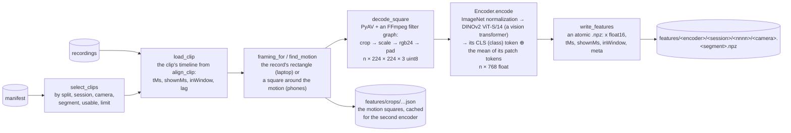

# 03 · Feature extraction: the frozen encoder and its cache

[← 02 · The dataset tooling](02-dataset.md) · [The pipeline](README.md) · next: [04 · Labels](04-labels.md)

A video frame is a grid of pixels: 224 × 224 × 3 colours is 150,528 numbers, and nothing in them says
"a hand is turning the right face". A **feature extractor** (here a pretrained vision network, the
**encoder**) turns a frame into a short vector, 768 numbers, that summarizes what is in the picture in a
way that similar pictures get similar vectors; the vector is also called an **embedding**. The pipeline
runs the encoder once over every frame of every clip and stores the vectors (`cubetrace-ml features`); every
later stage works on the vectors and never looks at pixels again.

Two decisions behind this stage. **Frozen**: the encoder's weights are never changed by this project's
training. It was trained by its authors on 142 million images; the 1,200 clips here could not teach a
vision network from scratch, but they can teach a small network what to do with the vectors of a good one.
This is **transfer learning**: in engineering terms, the encoder is a library linked as is, not code written
here. **Cached**: a frozen function of the frames is a pure function, so its outputs are memoized to disk,
one file per clip, and a retraining costs an hour of CPU (central processing unit) time instead of the hours of video decoding
and encoding.



| | In | Out |
|---|---|---|
| `cubetrace-ml features --encoder dinov2-vits14 --out <features root>` | the recordings, the manifest (or one built now), the clip selection (`--split`, `--session`, `--camera`, `--segment`, `--usable-only`, `--limit`), `--crop auto/record/none`, `--device`, `--precision`, `--batch`, `--workers` | one `.npz` per clip under `<features root>/<encoder>/`, the motion crops under `<features root>/crops/`, a throughput summary |
| `cubetrace-ml bench` | the same selection | a table of frames per second per stage, nothing written |
| `cubetrace-ml crop-preview` | one clip | a PNG (Portable Network Graphics) image with the record's and the motion's rectangles drawn on a frame |

## Selecting the clips: `select_clips`

The manifest's rows filtered by split, session (an id or a unique prefix), camera and segment, the usable
ones only by default, in session, attempt, segment and camera order, the first `--limit` of them. The
selection is deliberately the manifest's and not the folder's, so that a features run and a training run
agree on which clips exist.

## The framing: `framing.py`

The cube is small in a phone's full frame (1080 × 1920 pixels, the cube about 450 of them across: scaled whole to 224 it would be 50 pixels wide) and the
encoder sees 224 × 224. Feeding the whole frame would spend most of the 224 pixels on the room. So every
frame is cut to one rectangle per clip before it is scaled:

- **the record's rectangle** (`--crop record`, and `auto`'s first choice): the laptop's clips carry the
  framing the owner set in the app (`video[].crop`); it is cut as recorded (816 × 703 on the real clips)
  and letterboxed to a square;
- **a square around the motion** (`auto` when the clip has no rectangle: the phones): the clip is decoded
  once in gray at a short side of 160 pixels; the absolute differences of consecutive frames are summed
  over the frames of the segment's window (the hands and the cube move, the room does not); the map is
  blurred lightly (a 5-tap binomial blur), thresholded at 15% of its peak, and the bounding box of that
  mass is clamped to the 5th–95th percentiles of its column and row sums (a speck far from the hands
  carries too little mass to move the box); each side is padded by 15%, the box is made square (at least
  a quarter of the frame's shorter side, at most all of it) and shifted into the frame.

```python
def motion_framing(gray, frame_size, use=None, params=MOTION):
    """The square around the motion of the gray frames that `use` selects (the window's)."""
    width, height = frame_size
    energy = blur(motion_energy(gray, use), params.blur_taps)
    box = mass_box(energy, params.threshold, params.low, params.high)
    if box is None:
        return whole_frame(width, height), energy
    rows, cols = energy.shape
    sx, sy = width / cols, height / rows
    x0, y0, x1, y1 = box
    x, y, side = square_around((x0 * sx, y0 * sy, x1 * sx, y1 * sy), width, height,
                               pad=params.pad, min_side=params.min_side)
    return Framing(x, y, side, side, "motion", width, height), energy
```

On the real phone clips the motion's square is the frame's whole width (1080 × 1080: the hands reach
from edge to edge), placed on the motion's vertical centre, so the cube spans about 90 of the encoder's 224
pixels against about 140 in the laptop's rectangle. A tighter framing (a cube detector) is follow-up (h).
`crop-preview` draws both rectangles on a frame beside the energy map, to check the choice by eye.

## The decode: `video.decode_square`

Decoding video is the slowest part of this stage, slower than the encoder on a GPU (graphics processing unit). PyAV decodes the
H.264 stream with FFmpeg's C code; the cut, the scale and the letterbox run inside FFmpeg too, as a
**filter graph** on the decoder's native YUV frames (its luma-and-chroma colour format), before any pixel reaches Python:

```python
chain = [("crop", f"w={w}:h={h}:x={x}:y={y}:exact=1"),      # the rectangle, in the video's pixels
         ("scale", f"{sw}:{sh}:flags=area"),                 # the longer side to 224 (area averaging)
         ("format", "rgb24")]                                # YUV → RGB
if (sw, sh) != (size, size):
    chain.append(("pad", f"{size}:{size}:{(size - sw) // 2}:{(size - sh) // 2}:black"))  # letterbox
```

The filters are FFmpeg's [`crop`](https://ffmpeg.org/ffmpeg-filters.html#crop),
[`scale`](https://ffmpeg.org/ffmpeg-filters.html#scale-1), [`format`](https://ffmpeg.org/ffmpeg-filters.html#format-1)
and [`pad`](https://ffmpeg.org/ffmpeg-filters.html#pad-1). The result is one `uint8` array of shape
(frames, 224, 224, 3). This path runs at 300–400 frames a second per 4 CPU cores, 2.5 times faster than
converting whole RGB (red, green, blue) frames to NumPy and cropping there; a square rectangle is scaled without bars, so
nothing is distorted.

## The encoders: `encoders.py`

Each encoder is described by an `EncoderInfo` (its name, the input size it expects, the output
dimension, the normalization it was trained with, where its weights come from) and exposes one method:

```python
class Encoder:
    """A loaded encoder: `encode(frames)` maps n × S × S × 3 uint8 RGB frames to n × dim float32 features."""
    def encode(self, frames: np.ndarray) -> np.ndarray: ...
```

| Name | Input | Output | What it is |
|---|---|---|---|
| `stub` | 32 × 32 | 64 | no weights, no PyTorch: the gray frame times a fixed random matrix. The tests' encoder: it exercises every file format and resume rule without a download |
| `resnet18` | 224 × 224 | 512 | a **convolutional neural network** (CNN): stacks of small filters slid over the image, each layer detecting patterns of the previous one's (edges, textures, parts), with **residual** shortcuts that let gradients pass through 18 layers ([He et al. 2015](https://arxiv.org/abs/1512.03385)); torchvision's ImageNet weights; the output is the global average pool of the last feature map, the vector a classifier would read |
| `dinov2-vits14` | 224 × 224 | 768 | a **vision transformer** (ViT, [Dosovitskiy et al. 2020](https://arxiv.org/abs/2010.11929)): the image is cut into 14 × 14-pixel patches (16 × 16 = 256 of them), each patch becomes a token, and 12 layers of **self-attention** let every token look at every other, as a language model's words do; a 257th token, `CLS` (the class token), summarizes the whole image. **DINOv2** ([Oquab et al. 2023](https://arxiv.org/abs/2304.07193)) trained it **self-supervised**, without labels, by making the network give matching descriptions of different crops of the same image; its features transfer unusually well off the shelf. The vector is the `CLS` token (384) concatenated with the mean of the 256 patch tokens (384) |

DINOv2 is loaded through [timm](https://huggingface.co/docs/timm/index) (a library of pretrained vision
models; the weights come from the [Hugging Face Hub](https://huggingface.co/timm/vit_small_patch14_dinov2.lvd142m))
at an input of 224, its learnt position embeddings (one vector per patch position, which tell the transformer
where each patch sits) resized from the 37 × 37 grid of its native 518-pixel input to the 16 × 16 grid of 224; ResNet-18 through
[torchvision](https://pytorch.org/vision/stable/models/generated/torchvision.models.resnet18.html).
Both take the ImageNet mean and standard deviation per colour channel, the normalization their weights
were trained with (an input not normalized the same way would give garbage).

```python
class TorchEncoder(Encoder):
    def encode(self, frames: np.ndarray) -> np.ndarray:
        torch = self.torch
        with torch.inference_mode():                                  # no gradients: the encoder is frozen
            x = torch.from_numpy(np.ascontiguousarray(frames)).to(self.device)
            x = (x.permute(0, 3, 1, 2).float() / 255.0 - self.mean) / self.std   # n×S×S×3 → n×3×S×S, normalized
            with torch.autocast(self.device, dtype=torch.float16, enabled=self.precision == "fp16"):
                y = self.forward(self.module, x)
            return y.float().cpu().numpy()

def _dinov2(torch, pretrained):
    model = timm.create_model(TIMM_DINOV2, pretrained=pretrained, img_size=224, dynamic_img_size=True, num_classes=0)
    def forward(module, x):
        tokens = module.forward_features(x)            # n × 257 × 384: CLS, then the 256 patches
        cls = tokens[:, 0]
        patches = tokens[:, module.num_prefix_tokens:].mean(dim=1)
        return torch.cat([cls, patches], dim=1)        # n × 768
    return model, forward
```

`torch.inference_mode` tells PyTorch not to record the computation for backpropagation (nothing is
trained here), which saves the memory and time of recording the computation graph. On a GPU, `autocast` runs the network in
**fp16** (16-bit floating point: half the memory and a large speed-up on the GPU's tensor cores, at a
precision an embedding does not miss; the run used fp16 throughout, so the gain was not measured here); on the CPU it runs in fp32. The features are
stored as float16 either way.

The measured choice: DINOv2's features beat ResNet-18's on the real data (word error rate, WER: 0.489 against 0.54 for
the same model), as the research notes expected of a self-supervised ViT, so DINOv2 is the encoder of
every result since.

## The run: `features.extract`

```python
for item in _prepare(dataset, refs, time_base, crop_mode, crops_root):          # the timeline, the framing
    path = feature_path(root, name, item.ref)
    if not force and is_done(path, encoder=name, crop_mode=crop_mode, frames=item.frames):
        stats.skipped += 1                                                      # resume: already there
        continue
    todo.append(item)
for k, (clip, result) in enumerate(prefetch(todo, lambda c: decode_clip(dataset, c, size), workers), start=1):
    if isinstance(result, Exception):                                           # one bad clip does not stop the run
        stats.failed += 1; continue
    tick = time.perf_counter()
    x = encode_frames(encoder, result.frames, batch)                            # batches of 64 frames
    encode_seconds = time.perf_counter() - tick
    path = feature_path(root, name, clip.ref)
    meta = _meta(result, encoder, crop_mode, time_base, encode_seconds, str(path.relative_to(root)))
    write_features(path, {"x": x, "tMs": clip.t_ms, "shownMs": clip.shown_ms, "inWindow": clip.in_window}, meta)
    if result.framing.source == "motion" and not clip.crop_cached:
        save_crop(root, clip, result.framing, time_base)                        # the square, for the next encoder
```

- **Pipelining.** `prefetch` decodes `--workers` clips at once in threads, ahead of the encoder, so the
  GPU is fed while the CPU decodes the next clip; results are yielded in order and at most `workers + 1`
  decoded clips are held in memory.
- **Resuming.** A clip whose file exists, is readable and carries the same encoder, crop mode and frame
  count in its `meta` is skipped (`is_done`); `--force` rewrites. A file is written under a temporary
  name and renamed (`_replace_atomically`), so an interrupted run never leaves a half-written `.npz`:
  the write-to-a-temporary-file-then-rename discipline of any atomic save.
- **The crops cache.** The motion square of a phone clip costs a full decode in gray; it is saved as JSON (JavaScript Object Notation)
  with its parameters, so the second encoder (ResNet-18 after DINOv2) reuses it.
- **Errors** (an unreadable video, a record that fails validation, a decoded count that is not the frames
  file's) are counted and logged per clip; the command exits 1 when any failed.

## The files

`<out>/<encoder>/<sessionId>/<nnnn>/<camera>.<segment>.npz`, a NumPy
[`.npz`](https://numpy.org/doc/stable/reference/generated/numpy.savez.html) archive (a zip of arrays;
uncompressed, since float16 hardly compresses; read with `np.load(path)`):

| Array | Shape, type | Meaning |
|---|---|---|
| `x` | frames × dim, float16 | the encoder's vector of every frame, in order |
| `tMs` | frames, float64 | the frames' host times (the track's `tMs`) |
| `shownMs` | frames, float64 | `tMs − lag` |
| `inWindow` | frames, bool | `shownMs` inside the segment's window |
| `meta` | a JSON string | the encoder (name, size, dim, weights), the crop (the rectangle, its source, the motion parameters), the clip (ids, frame count, size, window), the time base and lag, the app's and this code's versions, the host (device, precision, torch version), the timing per stage |

Everything a later reader needs to trust the file is in `meta`: which build of the app recorded the clip,
which commit of this code and which weights wrote the features, on what hardware, how fast.

## Throughput, and why this stage runs on a GPU

`cubetrace-ml bench` runs the same pipeline without writing and prints a table of frames per second (fps) per
stage. On this project's 4-core container: the decode with the cut and the scale, 300–400 fps; ResNet-18,
56 fps; DINOv2, 20 fps. The bucket's 650,000 frames would take 9 hours with DINOv2 on that CPU. On one
NVIDIA L4 GPU (page 10, the batch machine): DINOv2 at 843 fps and ResNet-18 at 1,606 fps in fp16, the
decode at about 100 fps per worker with 6 workers, 352 fps overall; the whole bucket in 31 minutes for
DINOv2 and 20 for ResNet-18, about one dollar. The decode, not the network, sets the pace there.

## External tools on this page

| Tool | Why | Docs |
|---|---|---|
| PyTorch | the deep-learning framework: tensors on CPU or GPU, the networks, automatic differentiation | [pytorch.org/docs](https://pytorch.org/docs/stable/index.html) |
| torchvision | ResNet-18 and its ImageNet weights | [resnet18](https://pytorch.org/vision/stable/models/generated/torchvision.models.resnet18.html) |
| timm | DINOv2 ViT-S/14 and its weights | [timm docs](https://huggingface.co/docs/timm/index), [the model card](https://huggingface.co/timm/vit_small_patch14_dinov2.lvd142m) |
| DINOv2 | the self-supervised vision encoder | [paper](https://arxiv.org/abs/2304.07193), [code](https://github.com/facebookresearch/dinov2) |
| PyAV / FFmpeg filters | decoding, and the crop, scale and pad in C | [PyAV](https://pyav.org/docs/stable/), [FFmpeg filters](https://ffmpeg.org/ffmpeg-filters.html) |
| NumPy `.npz` | the per-clip cache | [numpy.savez](https://numpy.org/doc/stable/reference/generated/numpy.savez.html) |
| `torch.inference_mode`, `torch.autocast` | no gradient bookkeeping; fp16 on the GPU | [inference_mode](https://pytorch.org/docs/stable/generated/torch.inference_mode.html), [autocast](https://pytorch.org/docs/stable/amp.html) |

## Where in the code

| Concept | Module | Functions and classes |
|---|---|---|
| the selection | `features.py` | `select_clips`, `read_manifest` |
| the clip's timeline | `features.py` | `load_clip`, `Clip` |
| the framing | `framing.py` | `framing_for`, `record_framing`, `find_motion`, `motion_framing`, `motion_energy`, `blur`, `mass_box`, `square_around`, `Framing`, `MotionParams`, `crop_preview` |
| the decode | `video.py` | `decode_square`, `decode_gray`, `_filtered`, `_graph`, `letterbox_size` |
| the encoders | `encoders.py` | `ENCODERS`, `EncoderInfo`, `Encoder`, `StubEncoder`, `TorchEncoder`, `load_encoder`, `_resnet18`, `_dinov2` |
| the run and the cache | `features.py` | `extract`, `prefetch`, `decode_clip`, `encode_frames`, `write_features`, `read_features`, `is_done`, `cached_crop`, `save_crop`, `_meta`, `RunStats`, `summary`, `bench`, `bench_table` |
