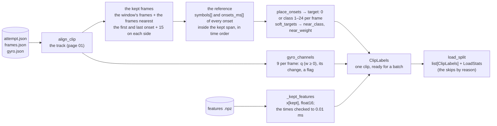

# 04 · Labels: what the model is asked to predict

[← 03 · Feature extraction](03-features.md) · [The pipeline](README.md) · next: [05 · The model](05-model.md)

**Supervised learning** fits a function to pairs (input, desired output). The desired outputs are the
**labels** (the "ground truth"). Here the input of a clip is its frames' features (page 03) and the label
is built from the cube's own report: for every frame, *is a move starting on this frame, and which one?*
`labels.py` turns an attempt's records into those per-frame labels, plus the **reference sequence** that
the evaluation scores against (page 08), plus the gyro's channels that the orientation experiments add to
the input (page 09). It also loads a whole split (every usable clip of `train`, `val` or `test`) with the
clips' cached features, which is what `train` and `evaluate` consume.



| | In | Out |
|---|---|---|
| `clip_labels(attempt, frames, ref, config, gyro=…)` | one clip's records | a `ClipLabels`: the kept frames, the reference, the per-frame target, the gyro channels |
| `load_split(dataset, manifest, split, features, encoder, config)` | the manifest's usable clips of a split, the features root | the clips' `ClipLabels` with their features loaded, and a `LoadStats` (how many loaded, skipped by reason, frames, symbols) |

## The configuration: `LabelConfig`

| Field | Default | Meaning |
|---|---|---|
| `margin` | 15 | frames kept on each side of the segment's window |
| `fps` | 0 | keep every k-th frame for this rate (15 on a 30-fps clip keeps every other frame); 0 keeps all |
| `label_frames`, `soft_decay` | 0, 0.5 | the soft target's reach and decay (below; off by default) |
| `time_base` | `fit` | the moves' clock (page 01) |
| `with_gyro`, `require_gyro` | false | read `gyro.json`; skip the clips whose kept frames have no orientation |
| `change` | `gyro` | the frame the orientation's change is taken in (`cube` for a calibrated run, page 09) |
| `with_pose` | false | compute the attempt's scramble pose (calibrated runs) |

`config.DataConfig.labels()` builds it from a run's TOML file (Tom's Obvious Minimal Language, the
configuration format of page 05).

## The kept frames

A clip begins a few seconds before its segment and ends a second after it. The model is shown the
**window** (the frames whose `shownMs` falls between the segment's first and last move), the frames
nearest the first and last onset (a window shorter than one frame interval would otherwise have no frame),
and a **margin** of 15 frames on each side, so that the context around the first and last move is visible
and the "before" and "after" frames teach what *no move* looks like. With `fps` (frames per second) set, every k-th of those
frames is kept (`frame_stride`: k = round(the clip's measured rate / fps)); this is the 15-fps **ablation** (a run with one thing removed, to measure its contribution), which cost
F1@50 symbol 0.54 → 0.46 on the real data.

```python
t_all = np.asarray(track["tMs"], dtype=np.float64)
onsets = np.array([aligned.onset_on_frames(s) for s in aligned.symbols])   # every onset, plus the lag
mine = np.array([s.phase == ref.segment for s in aligned.symbols])         # the segment's own
edges = [int(k) for k in np.flatnonzero(track["inWindow"])[[0, -1]]] if track["inWindow"].any() else []
if mine.any():                                                          # the segment's own onsets
    edges += [int(np.argmin(np.abs(t_all - onsets[mine].min()))), int(np.argmin(np.abs(t_all - onsets[mine].max())))]
if not edges:
    raise LabelError("no-window")
low = max(0, min(edges) - config.margin)
high = min(len(track) - 1, max(edges) + config.margin)
stride = frame_stride(t_all, config.fps)
kept = np.arange(low, high + 1, stride)
```

## The reference sequence

Every symbol of the attempt whose onset on the frames (`onset + lag`) falls inside the kept span (half a
frame interval beyond the first and last kept frame), in time order: the segment's own moves, and the
other segment's when the margin reaches one (counted as `foreign`; on the mirror none did). Two arrays:
`symbols` (alphabet indices 0–23) and `onsets_ms`. The same sequence feeds the per-frame target, the CTC (connectionist temporal classification) loss and the metrics, so all three see the same moves. A clip with an onset of its segment *outside* the
kept span is skipped (`moves-outside-frames`): a move the camera did not film cannot be a label.

## The per-frame target: `place_onsets`

The classes are 0 for "no onset" and `symbol index + 1` for the 24 symbols, 25 in all. Each onset, in time
order, is placed on the kept frame nearest to it. At 30 fps a frame is 33 ms long, so the placed label is at
most 17 ms from the true onset, under the stricter tolerance of the metrics. When two onsets want the same
frame (two turns 9 ms apart, which the cube does report), the later one takes the free neighbouring frame
nearer its time; when neither neighbour is free either, the onset keeps its place in the reference sequence
but gets no frame (a **collision**, counted; on the mirror there were none).

```python
def place_onsets(t_ms, onsets_ms, classes):
    target = np.zeros(len(t_ms), dtype=np.int64)
    collisions = 0
    for onset, cls in zip(onsets_ms, classes, strict=True):
        k = int(np.argmin(np.abs(t_ms - onset)))                      # the nearest kept frame
        neighbours = sorted((j for j in (k - 1, k + 1) if 0 <= j < len(t_ms)), key=lambda j: abs(t_ms[j] - onset))
        free = next((j for j in (k, *neighbours) if target[j] == NO_ONSET), None)
        if free is None:
            collisions += 1
            continue
        target[free] = cls
    return target, collisions
```

So the target of a 20-second solve clip at 30 fps is an array of about 600 integers, of which about 90
are non-zero (one per move, 4.5 moves a second): roughly one frame in seven carries an onset (one in nine over the real training split, whose kept frames
include the margins and the scrambles). That
imbalance is why the loss weights the onset classes (page 05).

**Soft targets** (`label_frames` k > 0, off by default): the frames within k of an onset's frame also
learn its class, with the weight `soft_decay ** d` at distance d and the rest on "no onset" (`near_class`,
`near_weight`). It is a way of telling the model "the move is around here" when the exact frame is
uncertain, related to what the literature calls label smoothing. The real runs did not need it.

## The gyro channels: `gyro_channels`

With `data.inputs = features+gyro`, nine numbers per kept frame are appended to the features: the cube's
orientation at the frame (`qx qy qz qw`, the track's interpolation of `gyro.json` at `shownMs`, flipped to
the hemisphere w ≥ 0 so that one orientation always reads the same; zeros without a sample), its **change**
since the previous kept frame (a quaternion; the identity at the first frame and wherever either frame has
none) and a **presence flag** (1 where the frame has an orientation). The change is taken in the gyro's
frame for M3's runs (the third task of `docs/PLAN.md`) (`q_t · conj(q_{t−1})`) and in the cube's own frame for the calibrated runs
(`conj(q_{t−1}) · q_t`, which no change of reference alters). Page 09 explains the quaternions and why the
raw orientation alone did not help.

```python
def gyro_channels(q, change="gyro"):
    present = np.isfinite(q).all(axis=1)
    out = np.zeros((len(q), 9), dtype=np.float32)
    held = q[present]
    out[present, :4] = np.where(held[:, 3:4] < 0, -held, held)          # q in the hemisphere w ≥ 0
    out[:, 4:8] = relative_rotations(q) if change == "gyro" else body_rotations(q)
    out[:, 8] = present
    return out
```

## Loading a split: `load_split`, `load_clips`

For every usable clip of the split (the manifest's `usable` rows, through `select_clips`): read the
records, build the labels, read the clip's `.npz` and keep the kept frames' rows of `x` (float16, cast to
float32 batch by batch in training to save memory: the 796 training clips are 337,168 kept frames × 768 numbers). The features file must have exactly the frames file's count and its kept frames' times must
match the labels' to 0.01 ms (`_kept_features`), or the clip is skipped as `features-mismatch`. The
other skip reasons are counted in `LoadStats` and printed by `train` and `evaluate`:

| Skip | Meaning |
|---|---|
| `records` | a record could not be read or validated (`gyro.json` included, when it is read) |
| `no-window` | the segment has no move and no frame shows its window |
| `moves-outside-frames` | an onset of the segment falls outside the clip's frames |
| `no-gyro` | with `require_gyro`: no `gyro.json`, or its samples cover none of the kept frames |
| `no-features`, `features-mismatch` | no readable features file for the encoder, or one that does not match the frames file |

`require_gyro` exists so that two runs can be compared on exactly the same clips: a run with the gyro and a
run without, both skipping the clips that have no gyro. On the real data 729 of the 796 training clips (172 of
the 220 val clips) and all 224 test clips have one.

`model_input(clip, inputs)` finally gives the model's input of a clip: `x` as float32, or `x` with the nine
gyro channels appended (768 + 9 columns for DINOv2).

## `ClipLabels`, the unit of work

| Field | Meaning |
|---|---|
| `ref` | the clip (`ClipRef`) |
| `frames`, `t_ms` | the kept frames' indices in the clip and their host times |
| `symbols`, `onsets_ms` | the reference sequence and its onsets on the frames' timeline |
| `target` | the per-frame class (0, or symbol + 1) |
| `near_class`, `near_weight` | the soft target (equal to `target` and 0/1 when off) |
| `lag_ms`, `tps`, `facelets` | the clip's lag, the attempt's TPS (turns per second), the scrambled state (for the replay metric of a solve clip) |
| `stride`, `collisions`, `foreign`, `split` | bookkeeping |
| `x` | the kept frames' features, frames × dim, float16 |
| `gyro`, `pose` | the nine gyro channels; the attempt's scramble pose (calibrated runs) |

## Where in the code

| Concept | Module | Functions and classes |
|---|---|---|
| the configuration | `labels.py`, `config.py` | `LabelConfig`, `DataConfig.labels` |
| one clip's labels | `labels.py` | `clip_labels`, `frame_stride`, `place_onsets`, `soft_targets`, `ClipLabels`, `LabelError`, `SKIPS`, `CLASSES` |
| the gyro channels | `labels.py`, `align.py`, `orientation.py` | `gyro_channels`, `GYRO_CHANNELS`, `relative_rotations`, `body_rotations` |
| loading a split | `labels.py` | `load_split`, `load_clips`, `_kept_features`, `LoadStats`, `model_input`, `calibration_key` |
