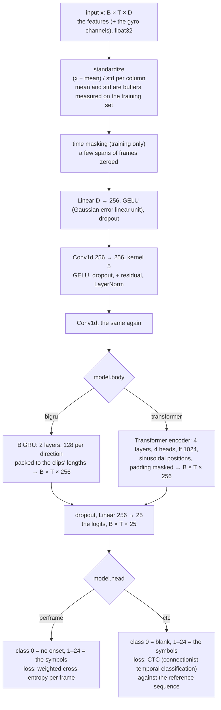

# 05 · The model: a small temporal network on the features

[← 04 · Labels](04-labels.md) · [The pipeline](README.md) · next: [06 · Training](06-training.md)

A **neural network** is a function with many adjustable numbers (its **parameters**, or **weights**),
built by composing simple layers: matrix multiplications, element-wise non-linear functions, and a few
structured operations such as convolutions and recurrences. Training (page 06) adjusts the parameters so
that the function's outputs match the labels on the training clips, by measuring the mismatch with a
**loss** and nudging every parameter in the direction that lowers it (**gradient descent**, with the
gradients computed automatically by PyTorch, which is what it is for).

The network here, `models.MoveModel`, maps a clip's input, a matrix of T frames × D numbers (D = 768 for
DINOv2, plus the gyro channels when they are on), to T × 25 scores: for every frame, one score per class,
"no onset" and the 24 symbols. It has about 1.45 million parameters with the default sizes (DINOv2 itself
has 22 million; it is frozen and not counted). It is small on purpose: the heavy lifting of seeing is done
by the encoder, and 729 training clips cannot support much more.



| | In | Out |
|---|---|---|
| `MoveModel.forward(x, mask, time_mask)` | `x` B × T × D (B clips of up to T frames, padded), `mask` B × T (True on real frames), an optional `time_mask` | the **logits**, B × T × 25 |
| `perframe_loss(logits, near_class, near_weight, mask, weights)` | the logits, the (soft) targets, the mask, the class weights | one number: the loss of the batch |
| `ctc_loss(logits, mask, targets)` | the logits, the mask, each clip's reference sequence | one number |

B is the batch size (8 clips), T the longest clip of the batch in kept frames.

## The layers, one by one

**Standardization.** Each input column is shifted and scaled so that, over the training frames, it has
mean 0 and standard deviation 1 (`(x − mean) / std`, a *z-score*). Networks train badly on inputs of
arbitrary scale; the encoder's 768 columns have scales of their own. The mean and standard deviation are
measured once on the training clips (page 06) and stored in the model as **buffers** (tensors that are part
of the saved state but not trained), so a checkpoint carries its own normalization and an evaluation
never has to recompute it.

```python
self.register_buffer("mean", torch.zeros(dim))
self.register_buffer("std", torch.ones(dim))

def standardize(self, x):
    return (x - self.mean) / self.std
```

**The projection.** `nn.Linear(dim, 256)`: a matrix multiplication (768 × 256 weights plus a bias) that
maps each frame's vector to the network's working width of 256, followed by **GELU** (the Gaussian error linear unit, a smooth non-linearity; without a non-linear function between layers a stack of matrices would collapse into one
matrix) and **dropout** (during training, each number is zeroed with probability 0.2; a regularizer that
stops the network from relying on any single feature, so it generalizes better).

**The convolutions.** Two `nn.Conv1d(256, 256, kernel_size=5, padding=2)`: a 1D convolution over *time*
slides a window of 5 frames along the clip and computes, for every frame, a combination of its own vector
and its two neighbours on each side. It is the natural detector of a short local pattern, "the features
changed like *this* over 5 frames", which is what a turn looks like. Each convolution is **residual**
(its output is added to its input, `h + conv(h)`, so the layer learns a correction and the gradient has a
shortcut) and followed by a **LayerNorm** (a per-frame renormalization that keeps the activations' scale
stable through the stack).

```python
h = self.dropout(F.gelu(self.proj(h))) * keep
for conv, norm in zip(self.convs, self.norms, strict=True):
    h = norm(h + self.dropout(F.gelu(conv(h.transpose(1, 2)).transpose(1, 2)))) * keep
```

(`keep` is the mask as 0/1: the padded frames are forced to zero after every layer, so they never
contribute to a real frame's output.)

**The body** is what gives each frame a view of the whole clip, and comes in two kinds, chosen by
`model.body`:

- **`bigru`** (the default, and the better one on the real data): a **gated recurrent unit** (GRU,
  [Cho et al. 2014](https://arxiv.org/abs/1406.1078)) is a **recurrent neural network** (RNN): it reads
  the sequence one frame at a time, keeping a hidden state of 128 numbers that it updates at every step
  with learnt "gates" deciding what to remember and what to overwrite, like a small state machine whose
  transition function is learnt. **Bidirectional** means two GRUs, one reading forward and one backward,
  their states concatenated (256 per frame), so every frame's output knows the past *and* the future: a
  turn is recognized from how the hands approach it and how they leave it. Two such layers are stacked.
  The clips of a batch have different lengths, so they are packed with `pack_padded_sequence`, which tells
  the GRU where each clip ends. An offline model may look at the future; a live one would need a delay of a
  few frames or a forward-only variant.
- **`transformer`**: a **transformer encoder** ([Vaswani et al. 2017](https://arxiv.org/abs/1706.03762))
  of 4 layers, where each frame computes **self-attention** weights over every other frame and gathers a
  weighted sum of their vectors (4 attention heads look at 4 different kinds of relation at once), then a
  feed-forward layer of width 1024 (a small two-layer network applied to each frame on its own). Attention does not know the order of its inputs, so a **sinusoidal
  position encoding** (a fixed pattern of sines and cosines of the frame index) is added first; the padded
  frames are masked out of the attention. On the real data it was slightly worse than the BiGRU (word error rate, WER, 0.53 against 0.49), as a small dataset often prefers the more constrained model.

```python
if self.body == "bigru":
    lengths = mask.sum(dim=1).cpu()
    packed = pack_padded_sequence(h, lengths, batch_first=True, enforce_sorted=False)
    out, _ = self.gru(packed)
    h, _ = pad_packed_sequence(out, batch_first=True, total_length=x.shape[1])
else:
    h = h + positions(h.shape[1], h.shape[2], h.device)
    h = self.final(self.encoder(h, src_key_padding_mask=~mask))
return self.head(self.dropout(h))
```

**The head.** `nn.Linear(256, 25)`: 25 scores per frame, the **logits**. A **softmax** turns them into
probabilities that sum to 1 (`exp(z_i) / Σ exp(z_j)`); the losses and the decoder (page 07) work on those.
The two heads share the architecture and differ only in what the 25 classes mean and in the loss:

## The two losses

**Per-frame cross-entropy** (`perframe`). For a frame whose target class is `c`, the loss is
`−log p_c`, the negative log of the probability the model gave the right class: 0 when it was sure and
right, large when it gave the right class a small probability. The batch's loss is the weighted mean over
the real frames. Two refinements:

- **Class weights.** About one frame in nine carries an onset (38,677 of the 337,168 training frames), so an unweighted mean would be dominated
  by the easy "no onset" frames and a model predicting "no onset" everywhere would already score well.
  `class_weights` gives "no onset" the weight 1 and every symbol the weight N0/N1 (the ratio of frames
  without and with an onset, measured on the training targets), so the onset frames weigh as much in all
  as the others.
- **Soft targets.** With `near_weight` w on `near_class` (page 04), the frame's loss is
  `−(w · log p_near + (1 − w) · log p_0)`; with hard targets this is PyTorch's weighted mean, which the tests
  check.

$$\mathcal{L} = \frac{\sum_{t} m_t \left[ w_t\, \omega_{c_t} \left(-\log p_{t,c_t}\right) + (1 - w_t)\, \omega_0 \left(-\log p_{t,0}\right) \right]}{\sum_t m_t \left[ w_t\, \omega_{c_t} + (1 - w_t)\, \omega_0 \right]}$$

where `m_t` is the mask, `ω` the class weights, `w_t` the soft weight and `c_t` the frame's class.

```python
def perframe_loss(logits, near_class, near_weight, mask, weights):
    logp = F.log_softmax(logits, dim=-1)
    on = near_weight * weights[near_class]
    off = (1.0 - near_weight) * weights[0]
    nll = -(off * logp[..., 0] + on * logp.gather(-1, near_class[..., None]).squeeze(-1))
    m = mask.to(logits.dtype)
    return (nll * m).sum() / ((on + off) * m).sum().clamp_min(1e-8)
```

**CTC** (`ctc`, **connectionist temporal classification**, [Graves et al. 2006](https://www.cs.toronto.edu/~graves/icml_2006.pdf)):
the loss that speech recognition uses when the transcript is known but not *when* each word was said. The
network emits one class per frame, with class 0 as a **blank**; any frame sequence that reads as the
reference after collapsing repeats and dropping blanks (`_ _ R R _ U _` → `R U`) is a valid alignment, and
the loss is minus the log of the total probability of all valid alignments, summed by dynamic programming
inside PyTorch's `F.ctc_loss`. It needs no per-frame target, only the sequence; the price is that it says
nothing about timing (the decoder takes the first frame of each spike) and that it starts from a plateau
where it emits only blanks. On the real data CTC converged to a worse WER (0.63) with poor timing (F1 0.36),
so the per-frame head is the one in use.

```python
def ctc_loss(logits, mask, targets):
    logp = F.log_softmax(logits, dim=-1).transpose(0, 1)        # T × B × 25, as ctc_loss wants it
    lengths = mask.sum(dim=1)
    flat = torch.cat([t.to(logits.device) for t in targets])
    target_lengths = torch.tensor([len(t) for t in targets], device=logits.device)
    return F.ctc_loss(logp, flat.long(), lengths, target_lengths, blank=0, reduction="mean", zero_infinity=True)
```

## The configuration: `config.py`

A run is described by a TOML (Tom's Obvious Minimal Language) file (`configs/perframe-bigru.toml`, `ctc-bigru.toml`,
`perframe-transformer.toml`) with the sections `data` (the labels and inputs of page 04, the calibration of
page 09), `model` (above), `train` (page 06), `decode` (page 07) and `paths`; every key is optional and has
the default shown in `config.py`'s dataclasses, and `--set section.key=value` overrides one on the command
line (the value parsed as TOML). `load_config` reads the file and applies the overrides, rejecting unknown keys and wrong types as each one is
set (`_set`); `check()` then rejects invalid values and inconsistent combinations (a calibration without the
gyro channels, for one). The resolved configuration is written as `config.json` into the run folder, so a run is reproducible
from its folder alone.

```toml
[model]
head = "perframe"
body = "bigru"
width = 256
conv_layers = 2
conv_kernel = 5
gru_hidden = 128     # per direction
gru_layers = 2
dropout = 0.2
```

## External tools on this page

| Tool | Why | Docs |
|---|---|---|
| `torch.nn` | the layers: `Linear`, `Conv1d`, `LayerNorm`, `GRU`, `TransformerEncoderLayer`, `Dropout` | [torch.nn](https://pytorch.org/docs/stable/nn.html) |
| `F.log_softmax`, `F.ctc_loss` | the losses | [log_softmax](https://pytorch.org/docs/stable/generated/torch.nn.functional.log_softmax.html), [ctc_loss](https://pytorch.org/docs/stable/generated/torch.nn.functional.ctc_loss.html) |
| `pack_padded_sequence` | variable-length clips through the GRU | [docs](https://pytorch.org/docs/stable/generated/torch.nn.utils.rnn.pack_padded_sequence.html) |
| TOML, `tomllib` | the run configuration | [toml.io](https://toml.io/), [tomllib](https://docs.python.org/3/library/tomllib.html) |

## Where in the code

| Concept | Module | Functions and classes |
|---|---|---|
| the network | `models.py` | `MoveModel` (`forward`, `standardize`, `set_normalization`), `positions` |
| the losses | `models.py` | `perframe_loss`, `ctc_loss`, `class_weights` |
| the configuration | `config.py` | `RunConfig`, `DataConfig`, `ModelConfig`, `TrainConfig`, `DecodeConfig`, `PathsConfig`, `load_config`, `parse_override`, `write_config`, `read_config` |
