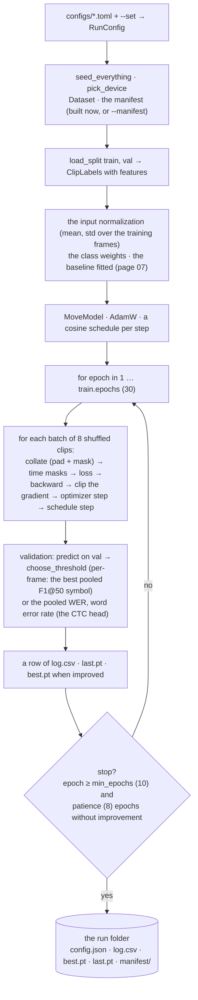

# 06 · Training: fitting the model to the training clips

[← 05 · The model](05-model.md) · [The pipeline](README.md) · next: [07 · Decoding](07-decoding.md)

Training is a loop. An **epoch** is one pass over the training clips. Inside it, the clips go through
the network in small groups, the **batches**; for each batch the loss is computed (the forward pass),
PyTorch computes the gradient of the loss with respect to every parameter (the backward pass,
**backpropagation**), and the **optimizer** moves every parameter a small step against its gradient. After
each epoch the model is scored on the **validation** clips, which it never trains on; the best epoch by
that score is kept, and the loop stops when the score has not improved for a while. `train.train_run`
is that loop, with the choices that make it reproducible and robust: seeds, a learning-rate schedule,
augmentation, gradient clipping, early stopping, checkpoints.



| | In | Out |
|---|---|---|
| `cubetrace-ml train --config configs/perframe-bigru.toml --root <dataset> --features <features root> --encoder dinov2-vits14 --manifest <manifest.parquet> --out runs/<name> [--set …]` | the configuration, the recordings, the manifest, the features cache | the run folder: `config.json`, `log.csv`, `best.pt`, `last.pt`, and `manifest/` when the run built its own |

```
cubetrace-ml train --config configs/perframe-bigru.toml --root $ROOT --features $F --encoder dinov2-vits14 \
    --manifest $M --set data.require_gyro=true --set data.inputs=features+gyro --set data.calibration=pose \
    --out runs/perframe-bigru-pose
```

## The set-up

**Seeds.** `seed_everything(seed)` seeds Python's `random`, PyTorch (on the CPU, the central processing unit, and on CUDA, NVIDIA's platform for computing on
a GPU, the graphics processing unit) and turns off the non-deterministic kernels of cuDNN (NVIDIA's
deep-learning library); the clips' order and the augmentation masks come from a NumPy generator of the
same seed. Two CPU runs with one seed give identical weights (a test checks it): a result can be
reproduced, and two runs that differ in one setting differ in nothing else.

**The device.** `train.device = auto` takes CUDA (NVIDIA's GPU platform) when PyTorch sees a GPU, else the
CPU. The real runs so far trained on 4 CPU cores, about 200 s an epoch for 796 clips: an hour or so per run.

**The data.** The manifest (`paths.manifest`, or built from the root now and written into the run folder,
so that `evaluate` scores the same split), then `load_split` for `train` and `val` (page 04). The loaded
clips stay in memory for the whole run as float16 and are cast to float32 batch by batch.

**The normalization.** The mean and standard deviation of every input column over the training frames
(`_moments`: float64 sums, the deviation floored at 1e-6), stored in the model's buffers. The gyro's
presence flag is left alone (mean 0, deviation 1): it can be 1 on every training frame, and standardizing
it would turn a 0 at test time into −10⁶. A calibrated run measures the orientation channels at the
training's starting rotations.

**The class weights** (`models.class_weights`, page 05) are counted on the training targets here. **The
baseline** (`evaluate.fit_baseline`, page 07) gets its symbol and shift from the training clips and its
threshold from the val clips; the checkpoint carries the baseline (and, in a calibrated run, the class weights).

## The optimizer and the schedule

**AdamW** ([Loshchilov & Hutter 2017](https://arxiv.org/abs/1711.05101)) is the standard optimizer for
networks of this kind: a per-parameter adaptive step (each weight moves by its gradient's running average divided by
the running root-mean-square of that gradient, so the step adapts to each weight's own scale of gradients)
with **weight decay** (every step also shrinks each weight by the learning rate × 0.01, a regularizer that
keeps the weights small).
The **learning rate** (`train.lr`, 1e-3) is the size of the step; too large and training diverges, too
small and it crawls.

The learning rate follows a **cosine schedule** stepped per batch: from `lr` at the first step down to 0
at the last planned step (30 epochs × the steps per epoch), along half a cosine. Large steps early explore;
small steps late settle into a minimum.

$$\eta_s = \eta_0 \cdot \tfrac{1}{2}\left(1 + \cos\frac{\pi s}{S}\right), \qquad s = \text{the step}, \; S = \text{epochs} \times \text{steps per epoch}$$

```python
optimizer = torch.optim.AdamW(model.parameters(), lr=config.train.lr, weight_decay=config.train.weight_decay)
steps_per_epoch = math.ceil(len(train) / config.train.batch)
total = max(1, config.train.epochs * steps_per_epoch)
schedule = torch.optim.lr_scheduler.LambdaLR(
    optimizer, lambda step: 0.5 * (1.0 + math.cos(math.pi * min(step, total) / total))
)
```

A calibrated run with learnt rotations (page 09) gives those parameters their own group, with the learning
rate `train.calibration_lr` (0.01) and no weight decay (a rotation should not be shrunk toward zero).

## The batches

The training clips are shuffled with the seeded generator and cut into batches of `train.batch` (8)
whole clips (`batch_order`). `collate` pads the clips of a batch to the longest with zeros and builds the
**mask** (True on real frames), the soft targets and each clip's reference sequence as class ids; the
network's layers multiply by the mask after every layer, so the padding changes no real frame's output
(a test checks it for both bodies).

```python
def collate(clips, device, inputs="features") -> Batch:
    lengths = [len(c) for c in clips]
    arrays = [model_input(c, inputs) for c in clips]
    longest, dim = max(lengths), arrays[0].shape[1]
    x = torch.zeros(len(clips), longest, dim)
    mask = torch.zeros(len(clips), longest, dtype=torch.bool)
    ...
    for i, clip in enumerate(clips):
        n = lengths[i]
        x[i, :n] = torch.from_numpy(arrays[i])
        mask[i, :n] = True
        near_class[i, :n] = torch.from_numpy(clip.near_class)
        near_weight[i, :n] = torch.from_numpy(clip.near_weight.astype(np.float32))
    return Batch(x.to(device), mask.to(device), near_class.to(device), near_weight.to(device),
                 [torch.from_numpy(c.symbols + 1) for c in clips], lengths)
```

**Augmentation: time masking.** For every training clip, `train.time_masks` (3) spans of 1 to
`train.time_mask_frames` (10) frames are chosen at random and their standardized inputs zeroed. The model
must then recover a move from its context, which makes it robust to a dropped frame or a brief occlusion
and is a regularizer against memorizing: the same trick as SpecAugment in speech recognition
([Park et al. 2019](https://arxiv.org/abs/1904.08779)). Augmentation in general means showing the model
altered copies of the data so that it cannot overfit the exact copies it has.

## The step

```python
time_mask = time_masks(batch.lengths, batch.x.shape[1], config.train.time_masks, config.train.time_mask_frames, rng)
loss = batch_loss(model, batch, head, weights, torch.from_numpy(time_mask).to(device))   # forward
if tie is not None:
    loss = loss + config.train.session_tie * tie().to(loss.device)                   # a calibrated run's option
optimizer.zero_grad(set_to_none=True)
loss.backward()                                                                      # the gradients
torch.nn.utils.clip_grad_norm_(model.parameters(), config.train.clip_grad)           # at most norm 1.0
optimizer.step()                                                                     # the update
schedule.step()                                                                      # the next learning rate
```

**Gradient clipping** rescales the whole gradient when its norm exceeds `train.clip_grad` (1.0), so one
unlucky batch cannot throw the weights far off; recurrent networks in particular are prone to such
spikes.

## Validation, selection and early stopping

After every epoch `predict` runs the model on the val clips without gradients and takes the softmax of
the logits, one T × 25 array of probabilities per clip. For the per-frame head, `choose_threshold` decodes
them at every threshold from 0.1 to 0.9 in steps of 0.05 (page 07) and keeps the one with the best
**pooled F1@50 (symbol)** (page 08); that F1 is the epoch's score, and the threshold is stored with the
checkpoint. For CTC (connectionist temporal classification) the score is the pooled WER. The decoding threshold is a setting the loss cannot learn,
which is exactly what a validation set is for; choosing it on the test set would leak the test into the
model.

The epoch's row goes to `log.csv` (`epoch`, `train_loss`, `val_loss`, `val_f1_50`, `val_wer`, `lr`,
`seconds`, `threshold`); `last.pt` is written every epoch and `best.pt` when the score improved. The loop
stops when `train.patience` (8) epochs have passed without improvement, but never before
`train.min_epochs` (10): CTC emits only blanks for its first hundred-odd steps, and a stop inside that
plateau would keep an empty model.

On the real data the val loss rises from the first epoch while the val F1 keeps improving until epoch
10–19: the model grows over-confident on frames it gets wrong (which the loss punishes) while getting more
onsets right (which the F1 rewards). That is **overfitting** on a small set, and it is why the selection is
on the F1 and why early stopping exists.

## The checkpoints

`best.pt` and `last.pt` are PyTorch files (`torch.save` of a dict; read with
`torch.load(path, weights_only=True)`) that hold everything an evaluation needs:

| Key | What |
|---|---|
| `state` | the model's parameters and buffers (the `state_dict`, the normalization included) |
| `config`, `dim` | the resolved configuration; the input width |
| `epoch`, `metrics` | the epoch and its train loss, val loss, val F1@50, val WER |
| `threshold` | the decoding threshold chosen on val (the best epoch's in `best.pt`) |
| `baseline` | the baseline's symbol, shift and threshold (page 07) |
| `data` | the train and val splits' counts (clips, frames, symbols, skips, gyro coverage) |
| `calibration` | a calibrated run's keys, learnt rotations, starts, the label-free guess, the class weights, the features' width (page 09) |

`load_run` rebuilds the model from `config.json` and the checkpoint; `evaluate_run` (page 08) is the
consumer.

## The run folder

| File | What |
|---|---|
| `config.json` | the resolved configuration, paths included |
| `log.csv` | one row per epoch |
| `best.pt`, `last.pt` | the checkpoints |
| `manifest/` | the manifest, when the run built it |
| `report.md`, `plots/`, `predictions.parquet`, `metrics.json`, `calibration.parquet` | written by `evaluate` (page 08); a split other than `test` adds its name, `report-val.md` |

`--force` clears a folder that holds a run. The folders are not committed (and the container's rebuild
of 2026-10-09 wiped every run so far; the numbers live in `docs/PLAN.md`, and syncing the folders to the
bucket is follow-up (v) there).

## External tools on this page

| Tool | Why | Docs |
|---|---|---|
| `torch.optim.AdamW` | the optimizer | [AdamW](https://pytorch.org/docs/stable/generated/torch.optim.AdamW.html) |
| `torch.optim.lr_scheduler.LambdaLR` | the cosine schedule | [LambdaLR](https://pytorch.org/docs/stable/generated/torch.optim.lr_scheduler.LambdaLR.html) |
| `torch.nn.utils.clip_grad_norm_` | gradient clipping | [clip_grad_norm_](https://pytorch.org/docs/stable/generated/torch.nn.utils.clip_grad_norm_.html) |
| `torch.save` / `torch.load` | the checkpoints | [serialization](https://pytorch.org/docs/stable/notes/serialization.html) |
| `torch.manual_seed`, cuDNN determinism | reproducibility | [reproducibility](https://pytorch.org/docs/stable/notes/randomness.html) |

## Where in the code

| Concept | Module | Functions and classes |
|---|---|---|
| the loop | `train.py` | `train_run`, `seed_everything`, `pick_device`, `_manifest`, `_dataset` |
| the normalization | `train.py` | `_moments`, `_normalization`, `_gyro_normalization`, `_input_normalization`, `_calibrated_normalization` |
| the batches and the augmentation | `train.py` | `collate`, `Batch`, `batch_order`, `time_masks`, `batch_loss` |
| validation and selection | `train.py`, `evaluate.py` | `predict`, `_better`, `choose_threshold`, `pooled` |
| the checkpoints | `train.py` | `_checkpoint`, `load_run`, `_clear` |
| a calibrated run's rotations | `train.py` | `RunCalibration` (page 09) |
