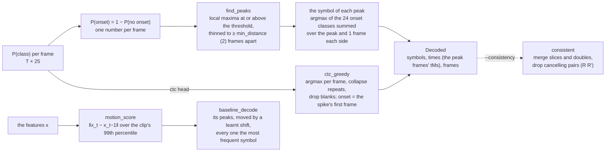

# 07 · Decoding: from per-frame probabilities to a move sequence

[← 06 · Training](06-training.md) · [The pipeline](README.md) · next: [08 · Evaluation](08-evaluation.md)

The network's output is a probability for each of 25 classes at every frame. That is not yet an answer:
the answer is a list of moves with the time each one began. The **decoder** makes the list. For the
per-frame head it is an engineer's edge detector: a one-dimensional signal (the probability that *some*
move starts here), a threshold, local maxima, and a dead time so that one move does not fire twice. For the CTC (connectionist temporal classification) head it is the standard greedy collapse. `decode.py` is NumPy only; the same code runs inside
training's validation (page 06) and inside the evaluation (page 08).



| | In | Out |
|---|---|---|
| `perframe_decode(probs, t_ms, threshold, min_distance, neighbours)` | one clip's T × 25 probabilities and its kept frames' times; the threshold chosen on val | a `Decoded`: `symbols` (alphabet indices), `times` (ms, on the frames' timeline), `frames` |
| `ctc_greedy(probs, t_ms)` | the same, from a CTC head | a `Decoded` |
| `consistent(decoded)` | a `Decoded` | a `Decoded` with the merges and cancellations applied |
| `baseline_decode(score, t_ms, threshold, symbol, shift_ms)` | the clip's motion score | a `Decoded` of one symbol |

## Peak picking: the per-frame decoder

**The onset curve.** `P(onset) = 1 − P(no onset)`, the probability that any move starts on the frame. It
is a cleaner signal than any single symbol's probability: when the model hesitates between `R` and `R'`,
both are small but their sum is large.

**The peaks.** `find_peaks` keeps the frames where the curve is a local maximum (strictly above the
previous frame, at or above the next: the first frame of a flat top; the clip's ends count) and at or
above the **threshold**, then thins them so that no two are closer than `min_distance` frames, the higher peak winning each
conflict. By the local-maximum rule alone two peaks are already at least 2 frames apart (two adjacent frames
cannot both be maxima), so the default of 2 removes nothing and only a larger value thins further; a top
with a one-frame dip can therefore fire twice, two frames (67 ms) apart, which the metrics count as one hit
and one invented move.

```python
def find_peaks(score, threshold, min_distance=MIN_DISTANCE):
    before = np.concatenate([[-np.inf], score[:-1]])
    after = np.concatenate([score[1:], [-np.inf]])
    peaks = np.flatnonzero((score > before) & (score >= after) & (score >= threshold))
    if min_distance <= 1 or len(peaks) < 2:
        return peaks
    keep = np.ones(len(peaks), dtype=bool)
    for k in np.argsort(-score[peaks], kind="stable"):      # the highest first
        if keep[k]:
            near = np.abs(peaks - peaks[k]) < min_distance
            near[k] = False
            keep &= ~near                                    # its neighbours lose
    return peaks[keep]
```

**The threshold** is not a constant: training chooses it on the validation clips after every epoch, among
0.1, 0.15, …, 0.9, by the pooled F1@50 on symbols, and the checkpoint stores it. A lower threshold finds more moves and invents more; a higher one misses more; the F1 balances the
two.

**The symbol.** At each peak, the 24 onset classes' probabilities are summed over the peak's frame and
`neighbours` (1) frames on each side, and the largest wins. Summing over three frames is a small vote
that makes the choice less sensitive to which frame the peak landed on. The onset time is the peak frame's
`tMs`; no interpolation between frames (follow-up (m) of `docs/PLAN.md`), which bounds the precision at
half a frame, 17 ms.

```python
def perframe_decode(probs, t_ms, threshold, *, min_distance=MIN_DISTANCE, neighbours=NEIGHBOURS):
    peaks = find_peaks(1.0 - probs[:, 0], threshold, min_distance)
    symbols = np.array(
        [int(np.argmax(probs[max(0, k - neighbours) : k + neighbours + 1, 1:].sum(axis=0))) for k in peaks]
    )
    return Decoded(symbols, np.asarray(t_ms, dtype=np.float64)[peaks], peaks)
```

## Greedy CTC decoding

For the CTC head, each frame's most probable class is taken; runs of the same class collapse into one
emission and blanks (class 0) are dropped: `_ _ R R _ U _` reads `R U`. A symbol's onset time is the first
frame of its run. This is the simplest CTC decoder (a beam search that keeps several candidate sequences
is the usual upgrade, and follow-up (l) imagines one that also keeps only sequences that replay to solved).

## The consistency pass (`--consistency`)

A post-processor that applies the alphabet's own rules to the predicted sequence: two adjacent quarter turns
of one face under 200 ms apart become its double, two opposite faces turning the same way under 20 ms apart
a slice (the normalization's rules of page 01), then adjacent cancelling pairs (`R R'`, `R2 R2`, `M M'`) are
dropped as on a stack, repeatedly. It is a guess that the model's duplicates and flickers are errors. On the
real model it *hurt* (word error rate, WER, 0.489 → 0.528): the model's errors are rarely of that kind, and the pass also
merges two genuine turns. It stays as an option and as a diagnostic.

## The baseline: what "no learning" achieves

Every evaluation also scores a **baseline**, a system with nothing learnt about the symbols, to show what
the model adds. It uses the motion alone: each frame's distance from the previous one in the standardized
features (`motion_score`, the norm of the difference, over the clip's 99th percentile, clipped to 1), its
peaks as above at a threshold chosen on val, moved back by a constant **shift** (the training clips' median
offset from a reference onset to the nearest motion peak within 100 ms, since motion peaks a little after
the onset), and every onset labelled with the training set's most frequent symbol.

```python
def motion_score(x):
    step = np.concatenate([[0.0], np.linalg.norm(np.diff(x, axis=0), axis=1)])
    scale = float(np.percentile(step, 99))
    return np.clip(step / scale, 0.0, 1.0) if scale > 0 else np.zeros(len(x))
```

On the real test split the baseline's WER is 1.62 (worse than predicting nothing) with an onset F1 on
timing of 0.52: the features' motion alone locates half the turns, and everything about *which* turn is
the model's. A baseline is the floor a result has to clear to mean anything; a model that does not beat the
baseline has learnt nothing, however it was trained.

## Where in the code

| Concept | Module | Functions and classes |
|---|---|---|
| the per-frame decoder | `decode.py` | `find_peaks`, `perframe_decode`, `Decoded`, `THRESHOLDS`, `MIN_DISTANCE`, `NEIGHBOURS` |
| the CTC decoder | `decode.py` | `ctc_greedy` |
| the consistency pass | `decode.py` | `consistent`, `inverse_symbol`, `_quarter` |
| the baseline | `decode.py`, `evaluate.py` | `motion_score`, `baseline_shift`, `baseline_decode`, `most_frequent`; `Baseline`, `fit_baseline`, `baseline_clip` |
| which decoder | `evaluate.py` | `decode_clip`, `onset_curve` |
