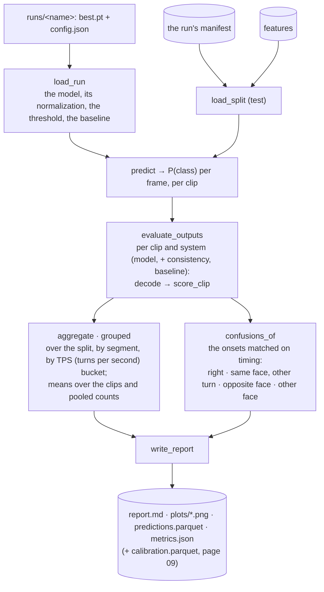

# 08 · Evaluation: how good is it, and where it fails

[← 07 · Decoding](07-decoding.md) · [The pipeline](README.md) · next: [09 · Orientation and calibration](09-orientation.md)

`cubetrace-ml evaluate` loads a run's checkpoint, decodes every clip of a split (`test` by default) and
scores the decoded sequences against the reference sequences (page 04), for the model, for the model
through the consistency pass, and for the baseline. It writes a Markdown report with tables and plots,
a table of every clip's predictions, and a JSON (JavaScript Object Notation) file of every number. The metrics are the vocabulary of every
result in `docs/PLAN.md`; this page defines each one from zero.



| | In | Out |
|---|---|---|
| `cubetrace-ml evaluate --run runs/<name> [--split test] [--checkpoint best] [--consistency] [--calibrate …]` | the run folder, the recordings, the manifest and features (the run's, or `--manifest`, `--features`) | `report.md`, `plots/` (`loss.png`, `f1-tolerance.png`, `wer-tps.png`, `onsets.png`), `predictions.parquet`, `metrics.json`; a summary line per system on stdout |

## The metrics, one by one

Every metric compares, for one clip, the **hypothesis** (the decoded sequence: symbols and onset times)
with the **reference** (the labels' sequence). `metrics.score_clip` computes them all for a clip.

**WER, word error rate.** The vocabulary of speech recognition, where the "words" here are moves. It is
the **edit distance** between the two symbol sequences (the fewest substitutions, insertions and
deletions that turn one into the other, each counting 1: [Levenshtein distance](https://en.wikipedia.org/wiki/Levenshtein_distance))
divided by the reference's length. A WER of 0.31 means about 3 edits per 10 reference moves; it can exceed
1 when the hypothesis is much longer than the reference (the baseline's 1.62). Timing plays no part.

$$\text{WER} = \frac{S + I + D}{N}$$

```python
def edit_distance(reference, hypothesis) -> int:
    ref, hyp = np.asarray(list(reference)), np.asarray(list(hypothesis))
    j = np.arange(len(hyp) + 1)
    previous = j.copy()
    for r in ref:                                   # the classic table, one row per reference symbol
        current = np.empty_like(previous)
        current[0] = previous[0] + 1
        current[1:] = np.minimum(previous[1:] + 1, previous[:-1] + (hyp != r))   # a deletion, a substitution
        previous = np.minimum.accumulate(current - j) + j                        # the insertions
    return int(previous[-1])
```

**Onset F1 at a tolerance.** The timing metric. Each predicted onset is matched one to one to a
reference onset within ± the tolerance (25 or 50 ms; inclusive), greedily in time order: each prediction
takes the earliest unmatched reference onset within reach, which gives as many matches as any matching can
when every onset has the same reach. Then:

- **TP** (true positives): the matched pairs;
- **FP** (false positives): predictions left unmatched, moves the model invented;
- **FN** (false negatives): reference onsets left unmatched, moves it missed;
- **precision** = TP / (TP + FP), the share of predictions that were right; **recall** = TP / (TP + FN), the
  share of real moves that were found; **F1**, their harmonic mean, which is high only when both are:

$$F_1 = \frac{2\,\text{TP}}{2\,\text{TP} + \text{FP} + \text{FN}}$$

Two modes: `timing` matches any symbol to any (*was a move found here?*); `symbol` matches equal symbols
only, each symbol on its own (*was the right move found here?*). The gap between the two is the symbol
error at the right time; the real model's F1@50 is 0.838 on timing and 0.726 on symbols.

```python
def match_times(reference, hypothesis, tolerance) -> list[tuple[int, int]]:
    ref_order, hyp_order = np.argsort(reference, kind="stable"), np.argsort(hypothesis, kind="stable")
    pairs, j = [], 0
    for h in hyp_order:
        t = hypothesis[h]
        while j < len(ref_order) and reference[ref_order[j]] < t - tolerance:
            j += 1                                              # references too early for any later prediction
        if j < len(ref_order) and reference[ref_order[j]] <= t + tolerance:
            pairs.append((int(ref_order[j]), int(h)))
            j += 1
    return pairs
```

**Exact**: the edit distance is 0, the whole sequence right. **Replay** (solve clips only): the predicted
sequence, applied to the attempt's `scrambledFacelets` on a cube simulator (`cube.py`: the 54 stickers in
Kociemba's order, each face turn a fixed permutation of them, a slice expanded into its two face turns),
leaves every face one colour. It is the strictest check: one wrong symbol fails it, and it is where the
cube's own consistency (the moves must solve the cube) could later help a decoder (follow-up (l)). The
report also counts the solve clips whose *reference* replays, which must be all of them, as a check on the
labels and the simulator.

```python
def apply(state: str, moves) -> str:
    """The facelets (54 letters in Kociemba order) after the moves."""
    codes = np.frombuffer(state.encode("ascii"), dtype=np.uint8).copy()
    gathers = _gathers()                      # per (face, quarter turns): the index array of the permutation
    for move in parse(moves):
        for face, turns in primitives(move):  # `M` → [(R, 1), (L, 3)]
            codes = codes[gathers[(face, turns)]]
    return codes.tobytes().decode("ascii")
```

**Means and pooled.** A split's number is given two ways: the mean over its clips (each clip's WER, F1,
… averaged; a short clip weighs as much as a long one) and **pooled** (the edits over all the reference
symbols; the F1 of the summed TP, FP and FN). Training's selection and the headline numbers use the pooled
ones, which are steadier on few clips. Everything is also given **by segment** (scramble clips against
solve clips) and **by TPS bucket** (the attempt's turns per second in bins of 0.5), to see whether speed
hurts.

**The confusions.** Among the onsets matched on timing within ±50 ms, the predicted symbol against the
reference's: `right`; `same face, other turn` (`R'` or `R2` for `R`); `opposite face` (`L` for `R`; a slice
for another slice); `other face`. Counted by kind, per reference symbol (the share right at its matched
onsets, as a grid of faces by `X`, `X'`, `X2`), the twelve most frequent pairs, and by camera (a camera's
clips told apart by whether they had a lag). This table is what told the story of the project: the first
real run was right on `U` and `D` (81–91%) and wrong on the side faces (`L` 26%, `R` 42%), with `F` → `B`
and `L` → `R` the top confusions, which is how the orientation sensor entered the model (page 09).

## The systems

Each clip is scored for three systems, side by side in every table: **model** (the head's decoding),
**model + consistency** (with `--consistency`, page 07) and **baseline** (page 07).

## The report

`report.write_report` writes, into the run folder (suffixed by the split's name when it is not `test`):

- **`report.md`**: a header table (the model, the features and frame rate, the inputs, the checkpoint
  and its epoch, the decoding rule and threshold, the baseline's settings, the reference replays); **The
  data** (each split's clips, frames, symbols, skips, gyro coverage); **the model against the baseline**
  (means and pooled); **By segment**; **By TPS bucket**; **The consistency pass** (when asked); **Confusions**;
  **Calibration** (a calibrated run, page 09); **F1 against the tolerance** (10 to 100 ms); the plots.
- **`plots/`** ([matplotlib](https://matplotlib.org/stable/), headless): `loss.png` (the train and val
  loss by epoch, and the val metric with its best epoch marked), `f1-tolerance.png` (pooled F1 against the
  matching tolerance, timing and symbol, per system), `wer-tps.png` (the mean WER per TPS bucket) and
  `onsets.png` (one clip's P(onset) over its first 8 seconds, the reference onsets as vertical lines with
  their symbols, the predicted ones as dots: the solve clip of the median WER, so neither the best nor the
  worst).
- **`predictions.parquet`**: one row per clip with the reference's and each system's symbols and onset
  times, and each system's WER, F1s, exact and replay: the raw material of any further analysis
  (`report.confusions_of` reads it back).
- **`metrics.json`**: every aggregate (all, by segment, by bucket, every tolerance from 10 to 100 ms), the
  checkpoint's metrics, the baseline, the confusion matrix, and the calibration's numbers.

```python
def write_report(run, evaluation, *, config, record, counts, checkpoint="best") -> list[Path]:
    summary = evaluation.summary()                       # per system: all, by segment, by bucket
    systems, plots, figures = evaluation.systems, run / "plots", {}
    figures["F1 against the tolerance"] = plot_tolerance(summary, systems, plots / "f1-tolerance.png")
    figures["WER by TPS bucket"] = plot_wer_by_tps(summary, systems, plots / "wer-tps.png")
    figures["One clip's P(onset) over its reference onsets"] = plot_clip(evaluation, pick_clip(evaluation), ...)
    frame = predictions_frame(evaluation)
    frame.write_parquet(run / "predictions.parquet")
    confusions = confusions_of(frame)
    metrics = {"run": config.name, "split": evaluation.split, "systems": summary, "confusions": confusions.to_json(), ...}
    (run / "metrics.json").write_text(json.dumps(_jsonable(metrics), indent=2) + "\n")
    (run / "report.md").write_text("\n".join(_report_lines(...)) + "\n")
```

## Reading a report

Start with the pooled row of the headline table: the WER and the two F1@50 columns, timing and symbol.
Timing low means the model does not find the turns (look at `onsets.png` and at the baseline: is the
motion even there?); timing high and symbol low means it finds them but names them wrong (look at the
Confusions section: which faces, which kind of error, which camera). Then the By TPS table: does the error
grow with speed? Then `f1-tolerance.png`: how fast the F1 falls from ±50 to ±25 ms says how precise the
timing is, and whether the lag (page 01) is right. The real runs' story in those terms: timing was good
from the first run (0.82), symbols were the problem (0.54), the confusions named the side faces, the
orientation fixed them (0.73).

## External tools on this page

| Tool | Why | Docs |
|---|---|---|
| matplotlib | the plots, rendered headless with the Agg backend | [matplotlib.org](https://matplotlib.org/stable/) |
| polars, Parquet | `predictions.parquet`, `calibration.parquet` | [docs.pola.rs](https://docs.pola.rs/) |

## Where in the code

| Concept | Module | Functions and classes |
|---|---|---|
| the metrics | `metrics.py` | `edit_distance`, `match_times`, `Counts`, `onset_counts`, `score_clip`, `ClipScore`, `aggregate`, `grouped`, `tps_bucket`, `Confusions`, `confusion_kind` |
| the simulator | `cube.py` | `apply`, `replay`, `is_solved`, `primitives`, `facelets`, `_gathers` |
| the evaluation | `evaluate.py` | `evaluate_outputs`, `Evaluation`, `ClipResult`, `decode_clip`, `onset_curve`, `pooled`, `pooled_f1`, `pooled_wer`, `reference_replays` |
| the entry point | `train.py` | `evaluate_run`, `load_run`, `_calibrations` |
| the report | `report.py` | `write_report`, `_report_lines`, `_headline`, `_by`, `_confusions`, `_calibration`, `plot_log`, `plot_tolerance`, `plot_wer_by_tps`, `plot_clip`, `pick_clip`, `predictions_frame`, `confusions_of` |
