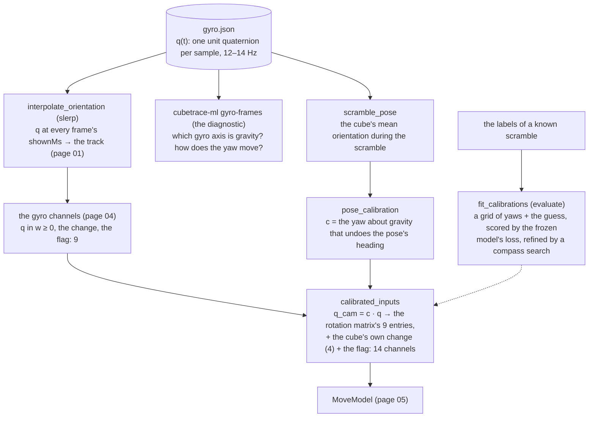

# 09 · Orientation and calibration: telling the model which face is which

[← 08 · Evaluation](08-evaluation.md) · [The pipeline](README.md) · next: [10 · Infrastructure](10-infrastructure.md)

The first real model found the turns (timing F1 0.82) but named the side faces wrong: `F` for `B`, `L`
for `R`, 26–48% right on `R`, `R'`, `L`, `L'`, `F`, `F'`, against 81–91% on `U` and `D`. The reason is in the
labels. The cube reports a turn of *its* face `R`, the face fixed to the cube; the camera sees a layer
turning on *its* right. The solver holds the cube with the white face up or down most of the time, so
up and down coincide, but every rotation of the cube in the hands changes which cube face is the
camera's right. Without knowing the cube's orientation, the model cannot tell `R` from `F` from `L` from
`B`. The cube carries a gyroscope that reports its orientation about 13 times a second; this page is how
that orientation becomes an input the model can use (M3, the third task of `docs/PLAN.md`), why the raw
sensor was not enough, and how a per-attempt **calibration** into the camera's frame fixed it (M4, the fourth): the side faces went to 79–84% right and
the WER (word error rate) from 0.49 to 0.31.



| | In | Out |
|---|---|---|
| `cubetrace-ml gyro-frames --root <dataset> [--out <folder>]` | every attempt's `gyro.json` | a report on the gyro's frame (gravity, the hold, the yaw's drift) and the advice for the calibration |
| `data.inputs = features+gyro`, `data.calibration = pose` (in `train`) | `gyro.json`, the attempt's scramble window | 14 orientation channels per frame appended to the features |
| `cubetrace-ml evaluate --calibrate none/pose/scramble/all` | a calibrated run, the test split | the four modes' numbers side by side; `calibration.parquet` with each attempt's rotation per mode |

## Orientation as a quaternion

A rotation in 3D can be written as a 3 × 3 **rotation matrix** or as a **unit quaternion**, four numbers
`(x, y, z, w)` of length 1 ([Wikipedia](https://en.wikipedia.org/wiki/Quaternions_and_spatial_rotation)).
The quaternion is what the cube's sensor sends. Three facts are enough for this page:

- `q` and `−q` are the same rotation (the "two signs"); the code picks the one with `w ≥ 0` wherever a
  unique representative matters (`hemisphere`).
- Two rotations compose by the **Hamilton product**, `a · b` meaning "`b`, then `a`"; the **conjugate**
  `(−x, −y, −z, w)` is the inverse. `align.quaternion_product` and `conjugate` are the NumPy versions,
  `calibrate.quaternion_product` the PyTorch one.
- The rotation matrix of `q` (`orientation.matrices`) has as its columns the images of the three axes: with
  the convention below, column k is the cube's axis k as seen from the gyro's frame. The matrix is
  continuous and sign-free, which is why the model is given the matrix's nine entries rather than the
  quaternion.

```python
def quaternion_product(a, b):
    """The Hamilton product `a · b` of quaternions (x, y, z, w): the rotation `b` then `a`."""
    ax, ay, az, aw = np.moveaxis(np.asarray(a, dtype=np.float64), -1, 0)
    bx, by, bz, bw = np.moveaxis(np.asarray(b, dtype=np.float64), -1, 0)
    return np.stack([aw * bx + ax * bw + ay * bz - az * by,
                     aw * by - ax * bz + ay * bw + az * bx,
                     aw * bz + ax * by - ay * bx + az * bw,
                     aw * bw - ax * bx - ay * by - az * bz], axis=-1)
```

The samples arrive at 12–14 Hz and the frames at 30; `align.interpolate_orientation` gives each frame the
orientation at its `shownMs` by **slerp** ([spherical linear interpolation](https://en.wikipedia.org/wiki/Slerp))
between the two samples around it, the natural interpolation between rotations.

**The convention**, which decides which side a calibration multiplies on: a sample's `q` takes the cube's
own axes into the gyro's frame, so a change of reference frame acts on the *left*, `q_cam = c · q`, and the
cube's own change between two samples, `conj(q_{t−1}) · q_t`, is the same in every reference frame. The
diagnostic checks it on the data: the sensor's angular velocity `v` (measured in the cube's own frame, the body frame) correlates
with the change taken in the cube's frame (Spearman 0.14–0.34 on the diagonal) and not with the change
taken in the gyro's (−0.08 to 0.00).

## M3: the raw orientation, and why it was not enough

M3 appended nine channels per frame to the features (`q` in `w ≥ 0`, its change since the previous kept
frame, a presence flag; page 04) and trained the same model with and without them on the same clips. The
result was a wash: WER 0.503 against 0.505, the side faces reshuffled rather than resolved (`B` up from
45% to 59%, `L` down from 31% to 22%). The reason: the gyro's frame is its own. Its vertical is fixed by
gravity, but its **yaw** (the heading about the vertical) is set arbitrarily at power-on and drifts, so the
same `q` means a different face toward the camera in each session, and the model cannot learn one function
from `q` to "the face the camera sees" across a handful of sessions. The orientation had to be expressed in
the **camera's** frame.

## The diagnostic: `gyro-frames`

Before designing the calibration, M4 measured what the gyro's frame does, from the records alone
(`gyroframes.py`, NumPy only). Per attempt and segment, every sample's rotation matrix gives the
direction of each cube axis in the gyro's frame; for each cube axis, the **principal direction** of those
samples is the top eigenvector of their orientation tensor (`axial_mode`: sign-free, so an axis held up
and held down count alike), and its **concentration** the top eigenvalue (1 when the axis kept one
direction throughout, 1/3 when it pointed everywhere); the segment's mean orientation is the
[chordal mean](https://ntrs.nasa.gov/citations/20070017872) of its quaternions. Pooled over attempts and
sessions:

```python
def axial_mode(directions):
    """The principal axis of unit vectors (n × 3), sign-free, and its eigenvalue (1/3 uniform … 1 one direction)."""
    d = np.asarray(directions, dtype=np.float64)
    tensor = d.T @ d / max(len(d), 1)
    values, vectors = np.linalg.eigh(tensor)
    mode = vectors[:, -1]
    if mode[np.argmax(np.abs(mode))] < 0:
        mode = -mode
    return mode, float(values[-1])
```

The findings on 410 real attempts in 5 sessions:

1. **Gravity is the gyro's z axis.** The cube's z axis (through the white face) keeps one direction in
   every attempt and session (pooled concentration 0.90; the other axes 0.5, every heading), 1.5° from the
   gyro's z. So only a **yaw** about z is arbitrary: the calibration needs one angle per attempt, not a
   whole rotation (`data.calibration_dof = yaw`, `data.gravity_axis = z`).
2. **The hold.** White up through all 410 scrambles and down through all 410 solves (the solver turns the
   cube over to solve cross-first), 15° off vertical.
3. **The yaw.** The sessions' mean headings sit up to 154° apart; within a session the heading drifts 5–43°
   an hour, with jumps; between consecutive attempts it moves 4.6° (median). So a yaw per *attempt*, not per
   session.

The command prints the report and the advice; `--out` writes `gyro-frames.md`, `.json` and `.parquet`.

## The calibration: one yaw per attempt, from the scramble's pose

**The idea.** The app prescribes the scramble in the cube's own frame ("apply `R U' F2 …` to the cube"), so
the solver holds the cube one definite way while applying it, facing the cameras. The cube's mean
orientation during the scramble, its **pose**, is therefore a reference that every attempt has: its heading
about the gravity axis is the gyro's arbitrary yaw plus a constant (how the solver faces the rig). Undoing
that heading puts every attempt in one frame, without any label:

```python
def scramble_pose(attempt, gyro, time_base="fit"):
    """The cube's mean orientation (the chordal mean) over the gyro's samples inside the scramble window."""
    sample_ms, quats = gyro_samples(gyro)
    low, high = segment_window(event_times(attempt, move_times(attempt, time_base)[0]), "scramble")
    inside = (sample_ms >= low) & (sample_ms <= high)
    if inside.sum() < MIN_POSE_SAMPLES:
        return None
    return chordal_mean(quats[inside])

def pose_calibration(pose, dof="yaw", axis="z"):
    """The rotation that undoes the pose: all of it (`rotation`), or only its heading about the gravity axis (`yaw`)."""
    if dof == "rotation":
        return hemisphere(conjugate(unit(pose)))
    return about(axis, -float(heading(unit(pose), axis)))
```

`heading(q, axis)` is the yaw of an orientation about an axis: the angle whose rotation about the axis,
undone, brings the orientation nearest the identity; `about(axis, angle)` is the quaternion of a rotation
by that angle about that axis.

**The calibrated channels** (`calibrate.calibrated_inputs`, in PyTorch, and `orientation.calibrated_channels`,
its NumPy twin for the normalization): with the clip's rotation `c`, the orientation in the camera's
frame `c · q` as its rotation matrix's 9 entries (zeros where the frame has no sample), then the cube's own
change (4) and the flag: 14 channels after the 768 features.

```python
def calibrated_inputs(x, c, dim, orientation="matrix"):
    features, q, change, flag = x[..., :dim], x[..., dim : dim + 4], x[..., dim + 4 : dim + 8], x[..., -1:]
    cam = quaternion_product(c[:, None, :].to(x.dtype), q)        # c · q, one c per clip of the batch
    if orientation == "matrix":
        rotated = matrices(cam).flatten(-2) * flag                 # 9 entries, sign-free
    else:
        rotated = torch.where(cam[..., 3:] < 0, -cam, cam) * flag  # the quaternion in w ≥ 0
    return torch.cat([features, rotated, change, flag], dim=-1)
```

**The kinds** (`data.calibration`): `none` (M3's raw channels), `identity` (the calibrated channels with
`c` the identity), `pose` (`c` is each attempt's pose undone; nothing learnt: **the configuration in use**),
`attempt` (one rotation **learnt** per training attempt, a parameter of the network started from the pose,
`calibration_init = pose`, or from the identity) and `camera` (one per attempt and camera). A learnt
rotation is stored as its yaw angle (`calibrate.Calibrations`, an `nn.Module` with one parameter per key),
so it is always a valid rotation; it gets its own learning rate (`train.calibration_lr`) and an optional
pull toward the other attempts of its session (`train.session_tie`, off). For the attempts the training
never saw (val, and the evaluated split), a learnt run guesses the rotation from the pose through the
training's mean correction (`calibrate.Guess`: the chordal mean of each learnt rotation times its own start
undone, used when 80% of the training keys' corrections agree within 45°).

## Estimating the rotation from labels: the four modes of `evaluate`

A calibrated run is evaluated four times on the same clips, each time giving the attempts their rotation
differently (`train.evaluate_run`, `calibrate.fit_calibrations`):

| Mode | The rotation | Why it matters |
|---|---|---|
| `none` | the identity: the gyro's frame as it is | what M3 measured |
| `pose` | the scramble pose undone, **no labels** | what a live system could do |
| `scramble` | fit on the scramble clips' labels, the network frozen | **honest**: the scramble's moves are known before the solve, so the solve clips' labels are never read |
| `all` | fit on every clip's labels | the **oracle**: the upper bound |

A fit scores the attempt's clips' loss (the training's weighted cross-entropy, with the checkpoint's class
weights) at every candidate of a grid, the 24 yaws about the gravity axis in 15° steps (for a whole
rotation, those yaws composed with the cube's 24 symmetries: 144 distinct rotations), plus the attempt's
guess; `calibrate.Scorer` batches the candidates through the frozen network. The best three are refined by
a **compass search** ([pattern search](https://en.wikipedia.org/wiki/Pattern_search_(optimization)): each
moves to the better of its two neighbours at ± the step about the axis, at most twice per step, and the step
halves, 7.5°, 3.75°, 1.875°, until it is under 1°; forward passes only, since on a CPU (central processing unit) a backward pass through the BiGRU (the recurrent body of page 05)
costs ten forward ones)
or, with `--refine adam`, by twelve steps of Adam on the angle. The result per attempt (`Fit`: the rotation,
its loss, the loss at the identity and at the guess, what it was fit on) goes to `calibration.parquet`.

```python
candidates = torch.cat([grid, guess[None, :]]).to(device)          # 24 yaws (or 144 rotations) + the guess
losses = scorer.losses(candidates)                                 # the frozen model's loss at each
chosen = np.argsort(losses, kind="stable")[:top]                   # the best three
refined, refined_loss = search(scorer, candidates[chosen], losses[chosen], dof, axis)
k = int(np.argmin(refined_loss))
```

## The result

The `pose` run (every training attempt in the frame of its own scramble pose; test = the 224 clips of
2026-10-03):

| mode | WER | F1@50 timing / symbol | F1@25 timing / symbol |
|---|---|---|---|
| `none` (the identity) | 0.439 | 0.813 / 0.600 | 0.674 / 0.511 |
| `pose` (no labels) | **0.311** | **0.838 / 0.726** | **0.695 / 0.612** |
| `scramble` (honest) | 0.321 | 0.838 / 0.716 | 0.696 / 0.605 |
| `all` (oracle) | 0.308 | 0.838 / 0.727 | 0.695 / 0.613 |

The label-free `pose` calibration equals the oracle: at the matched onsets the symbol is right 84% (64%
before), the side faces 79–84%, the opposite-face errors 11% → 2%. In the learnt-rotation run (`attempt`) the honest fit landed 20° from the oracle's rotation at the
median (49° at the 90th percentile) while the label-free pose matched the oracle's numbers: the pose is the
better guess, which says the owner holds the cube the same way at every scramble. Two cameras in one attempt share one rotation (`attempt` keys); a
rotation per camera (`camera`) and the camera's pitch are follow-ups (s) and (t).

## External tools on this page

| Tool or reference | Why | Link |
|---|---|---|
| quaternions, slerp, rotation matrices | the orientation's arithmetic | [quaternions and spatial rotation](https://en.wikipedia.org/wiki/Quaternions_and_spatial_rotation), [slerp](https://en.wikipedia.org/wiki/Slerp), [rotation matrix](https://en.wikipedia.org/wiki/Rotation_matrix) |
| the chordal mean | the mean orientation of a set of quaternions | [Markley et al., *Averaging quaternions*](https://ntrs.nasa.gov/citations/20070017872) |
| the matrix → quaternion conversion | `from_matrices` | [Bar-Itzhack's method](https://doi.org/10.2514/2.4654) |
| Spearman's rank correlation | the convention's check | [Wikipedia](https://en.wikipedia.org/wiki/Spearman%27s_rank_correlation_coefficient) |
| pattern (compass) search | the fits' refinement | [Wikipedia](https://en.wikipedia.org/wiki/Pattern_search_(optimization)) |
| `torch.nn.Parameter` | the learnt rotations | [docs](https://pytorch.org/docs/stable/generated/torch.nn.parameter.Parameter.html) |

## Where in the code

| Concept | Module | Functions and classes |
|---|---|---|
| the arithmetic | `align.py`, `orientation.py` | `quaternion_product`, `conjugate`, `slerp`, `interpolate_orientation`, `relative_rotations`; `unit`, `hemisphere`, `matrices`, `from_matrices`, `about`, `exp_map`, `log_map`, `angle_between`, `heading`, `chordal_mean`, `body_rotations` |
| the diagnostic | `gyroframes.py` | `diagnose`, `attempt_frames`, `segment_frames`, `axial_mode`, `_convention`, `_axes`, `_gravity`, `_held`, `_yaw`, `advice`, `report_text`, `write_outputs` |
| the pose and the channels | `orientation.py`, `labels.py` | `scramble_pose`, `pose_calibration`, `project`, `calibrated_channels`, `channel_names`; `gyro_channels` |
| in PyTorch | `calibrate.py` | `calibrated_inputs`, `Calibrations`, `session_tie`, `Guess`, `guess_of`, `frame_losses`, `Scorer`, `search`, `refine`, `fit_calibrations`, `key_groups`, `Fit` |
| the grids | `orientation.py` | `yaw_grid`, `cube_rotations`, `rotation_grid`, `calibration_grid`, `distinct` |
| in training and evaluation | `train.py`, `report.py` | `RunCalibration`, `_calibrations`, `_calibration_row`; `CalibrationResult`, `_calibration` |
