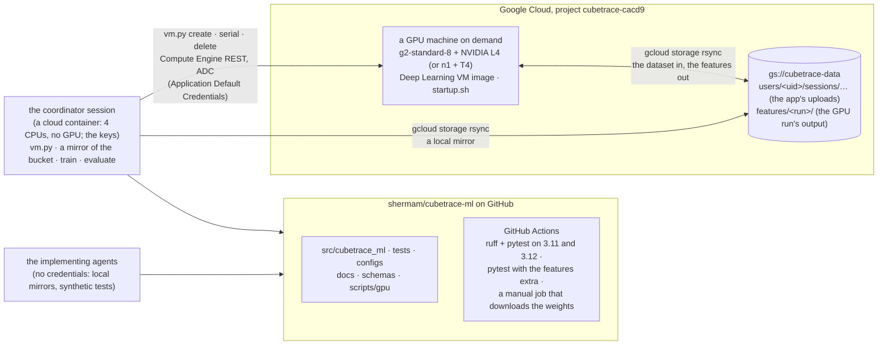

# 10 · Infrastructure: the repository, the bucket, the GPU machine

[← 09 · Orientation and calibration](09-orientation.md) · [The pipeline](README.md) · next: [Glossary](glossary.md)

Where the code lives and how it is checked (continuous integration, CI), where the data lives and who may read it, and the one piece of hardware the pipeline rents: a GPU (graphics processing unit) machine that extracts the features of the whole dataset in under an
hour and shuts itself down.



## The repository

A standard Python project in the `src/` layout (`src/cubetrace_ml/` is the package, `cubetrace-ml` the
console script that `cli.py` provides), managed with [uv](https://docs.astral.sh/uv/) (a fast package and
environment manager with a lockfile, `uv.lock`, so that every machine installs the same versions),
linted and formatted with [ruff](https://docs.astral.sh/ruff/), tested with
[pytest](https://docs.pytest.org/) (220 tests), built with [hatchling](https://hatch.pypa.io/latest/).
`pyproject.toml` declares the dependencies in groups:

| Group | What | When |
|---|---|---|
| base | `av` (PyAV), `jsonschema`, `matplotlib`, `numpy`, `pillow`, `polars` | always: the dataset tooling, the labels, the metrics, the report |
| extra `gcs` | `google-cloud-storage` | reading `gs://` roots: the coordinator only |
| extra `features` | `torch` and `torchvision` from PyTorch's **CPU** (central processing unit) package index, `timm` from PyPI (the Python Package Index) | the encoders, training and evaluation on a CPU machine (and CI) |
| extra `cu128` | `torch` and `torchvision` from PyTorch's **CUDA 12.8** index (CUDA: NVIDIA's platform for computing on a GPU), `timm` from PyPI | the GPU machine |
| group `dev` | `pytest`, `ruff` | development |

`features` and `cu128` exclude each other (uv's `conflicts`): PyTorch publishes a build per accelerator,
and the project's lock pins both so that `uv sync --extra cu128` on the GPU machine is as reproducible as
`--extra features` on a laptop. Two practical constraints shaped this: PyPI's own Linux `torch` wheel is the
CUDA build (2.5 GB more than needed on a CPU), and the coordinator's cloud container cannot reach
download.pytorch.org or huggingface.co, so any change to the PyTorch entries of the lock is resolved on a
CI runner and committed from there.

The tests never touch the network or real data: `tests/factory.py` generates synthetic records that pass
the schemas, writes 24-frame MP4 video files with PyAV, and plants a synthetic signal in synthetic features so that
the training tests can check that the model beats the baseline in a few CPU epochs. The `stub` encoder
exists for them.

`schemas/` holds copies of the app's JSON (JavaScript Object Notation) Schemas with the app commit they were taken from
(`scripts/sync-schemas.sh` refreshes them), so this repository validates exactly what the app wrote.

## Continuous integration

`.github/workflows/ci.yml` ([GitHub Actions](https://docs.github.com/en/actions)) runs on every push and
pull request:

- **checks**: `uv sync --locked --extra gcs`, then `ruff check`, `ruff format --check` and `pytest`, on
  Python 3.11 and 3.12 (the PyTorch tests skip without the extra);
- **features**: `uv sync --locked --extra features --extra gcs` (PyTorch's CPU build, cached by
  [setup-uv](https://github.com/astral-sh/setup-uv)) and every test, the training tests included
  (about 30 s);
- **weights** (manual, "Run workflow"): `scripts/check_encoders.py`, which downloads ResNet-18's and
  DINOv2's pretrained weights and runs `cubetrace-ml features` on the synthetic dataset, the one place
  short of the GPU machine where the real encoders are exercised.

## The data and the keys

The recordings are the owner's and are never in the repository, never printed, never copied into a test.
They live in the bucket `gs://cubetrace-data` under `users/<uid>/sessions/…`, where the app's cloud
functions put them (signed uploads; the app's own repository documents that side). The coordinator reads
the bucket with [Application Default Credentials](https://cloud.google.com/docs/authentication/application-default-credentials)
(ADC) from a service-account key that exists only in the coordinator's environment and is written to a temporary
file with mode 0600 for the duration of a command; the implementing agents work on local mirrors the
coordinator provides and never hold a key. The features of the GPU run live under
`gs://cubetrace-data/features/<run>/` and are mirrored locally for training with
[`gcloud storage rsync`](https://cloud.google.com/sdk/gcloud/reference/storage/rsync).

## The GPU machine

Page 03 measured DINOv2 at 20 frames a second on the container's CPU (ResNet-18 at 56); the bucket has 650,000
frames. The machine that does the job is a [Compute Engine](https://cloud.google.com/compute/docs)
instance created on demand, from a [Deep Learning VM (virtual machine) image](https://cloud.google.com/deep-learning-vm/docs/images)
(Ubuntu 24.04 with CUDA 12.9; it installs the NVIDIA driver 580 on its first boot, and the startup script
waits for it), with one
[NVIDIA L4](https://cloud.google.com/compute/docs/gpus#l4-gpus) on a `g2-standard-8` (8 vCPUs, virtual processor cores, 32 GB; an
`n1-standard-8` with a T4 is the fallback). It is a batch job: it boots, works, uploads its results and
logs, and shuts itself down, so a forgotten machine stops costing compute (its disk bills until `vm.py delete`). No one logs into it. `docs/GPU.md` is
the operator's page; the two scripts:

**`scripts/gpu/vm.py`**, the coordinator's driver, speaks to the
[Compute Engine REST API](https://cloud.google.com/compute/docs/reference/rest/v1) (REST:
representational state transfer; API: application programming interface) with the deploy
service account's credentials (it needs the roles Compute Instance Admin and Service Account User):

| Command | What |
|---|---|
| `check` | the project, the GPU quotas of the region, the default compute service account, the image family |
| `create --name … --data-root gs://… --out-prefix gs://… [--encoders …] [--args "--limit 20"] [--zone …] [--machine … --gpu …] [--spot]` | the instance, with `startup.sh` and the run's settings as instance [metadata](https://cloud.google.com/compute/docs/metadata/overview) |
| `serial --name … --follow` | the machine's serial console, until the line `CUBETRACE-ML-STATUS <n>` |
| `status`, `delete` | as named |

```python
items = [{"key": "startup-script", "value": startup},
         {"key": "install-nvidia-driver", "value": "True"},
         {"key": "ml-data-root", "value": args.data_root},
         {"key": "ml-out-prefix", "value": args.out_prefix},
         {"key": "ml-encoders", "value": args.encoders}, ...]
body = {"name": args.name,
        "machineType": f"zones/{zone}/machineTypes/{args.machine}",
        "disks": [{"boot": True, "autoDelete": True, "initializeParams": {"sourceImage": IMAGE_FAMILY, ...}}],
        "serviceAccounts": [{"email": args.service_account or "default", "scopes": SCOPES}],
        "metadata": {"items": items},
        "scheduling": {"onHostMaintenance": "TERMINATE", "automaticRestart": False}, ...}
if args.gpu:
    body["guestAccelerators"] = [{"acceleratorType": f"zones/{zone}/acceleratorTypes/{args.gpu}", "acceleratorCount": 1}]
```

**`scripts/gpu/startup.sh`**, the machine's [startup script](https://cloud.google.com/compute/docs/instances/startup-scripts/linux),
run as root at boot, reads its settings from the metadata and does, in order: wait for the NVIDIA driver
(`nvidia-smi`), install uv, clone this repository at the requested ref, `uv sync --locked --extra cu128
--extra gcs`, check that the encoders load on CUDA, mirror the dataset's `sessions/` to the local disk
(`gcloud storage rsync`: same region, minutes), print the dataset report, run `cubetrace-ml features`
for each encoder with `/mnt/features` as the root and the vCPUs minus 2 as decoding workers, sync
`/mnt/features` to the run's bucket prefix after each encoder (so an interrupted run resumes), upload the
logs, print the status line and shut down. A marker file keeps a rebooted machine from running twice.

| Status | Meaning |
|---|---|
| 0 | everything written |
| 2, 3 | missing settings; no driver after ten minutes |
| 4, 5 | the uv install, git or `uv sync` failed; the encoders could not load on CUDA |
| 6 | the mirror from the bucket failed (the machine's service account lacks the bucket role) |
| 7, 8 | a `features` run exited with an error; the sync to the bucket failed |

The run of 2026-10-07 (`ml-features-1`, us-west1-a, since every zone of us-central1 and us-east1 was out of
single GPUs that evening): status 0 in 52 minutes end to end, DINOv2 on 1,240 clips and 649,792 frames in
31 minutes (843 frames a second on the GPU, the decode at 100 a second per worker the bottleneck),
ResNet-18 in 20 (the motion crops cached from the first pass), 1.6 GB under
`gs://cubetrace-data/features/2026-10-07/`, about one dollar. Single-GPU stockouts are the norm:
`create` takes one `--zone`, and the coordinator retries another by hand.

## Where results live, and what is ephemeral

| Thing | Where | Durable? |
|---|---|---|
| the code and its docs | GitHub | yes |
| the recordings | the bucket | yes (the owner's) |
| the features | the bucket, `features/<run>/` | yes |
| the run folders (`best.pt`, reports, predictions) | the machine that trained them (`runs/`) | **no**: the coordinator's container is rebuilt without notice (it was on 2026-10-09, and every run folder went with it); the numbers survive in `docs/PLAN.md`, and syncing `runs/` to the bucket is follow-up (v) there |
| the GPU machine | Compute Engine | no, by design: deleted after every run |

## External tools on this page

| Tool | Why | Docs |
|---|---|---|
| uv | environments, the lockfile, the extras | [docs.astral.sh/uv](https://docs.astral.sh/uv/) |
| ruff | lint and format | [docs.astral.sh/ruff](https://docs.astral.sh/ruff/) |
| pytest | the tests | [docs.pytest.org](https://docs.pytest.org/) |
| hatchling | the build backend | [hatch.pypa.io](https://hatch.pypa.io/latest/) |
| GitHub Actions, setup-uv | CI | [docs.github.com/actions](https://docs.github.com/en/actions), [setup-uv](https://github.com/astral-sh/setup-uv) |
| Google Cloud Storage, `gcloud storage rsync` | the data | [storage docs](https://cloud.google.com/storage/docs), [rsync](https://cloud.google.com/sdk/gcloud/reference/storage/rsync) |
| Compute Engine, its REST API, startup scripts, metadata | the GPU machine | [compute docs](https://cloud.google.com/compute/docs), [REST](https://cloud.google.com/compute/docs/reference/rest/v1), [startup scripts](https://cloud.google.com/compute/docs/instances/startup-scripts/linux) |
| Deep Learning VM images | CUDA and the driver preinstalled | [images](https://cloud.google.com/deep-learning-vm/docs/images) |
| NVIDIA L4 and T4 GPUs, Spot VMs | the accelerator; cheaper interruptible pricing (`--spot`) | [GPUs](https://cloud.google.com/compute/docs/gpus), [Spot](https://cloud.google.com/compute/docs/instances/spot) |
| Application Default Credentials | how the coordinator authenticates | [ADC](https://cloud.google.com/docs/authentication/application-default-credentials) |

## Where in the code

| Concept | File | Functions |
|---|---|---|
| the project | `pyproject.toml` | the dependencies, the extras, the indexes, ruff's and pytest's settings |
| CI | `.github/workflows/ci.yml` | the three jobs |
| the encoders' smoke test | `scripts/check_encoders.py` | `check`, `run` |
| the driver | `scripts/gpu/vm.py` | `check`, `create`, `instance_body`, `wait_operation`, `serial`, `status`, `delete` |
| the machine's job | `scripts/gpu/startup.sh` | `meta`, `finish`, the steps |
| the schemas | `scripts/sync-schemas.sh`, `schemas/README.md` | – |
