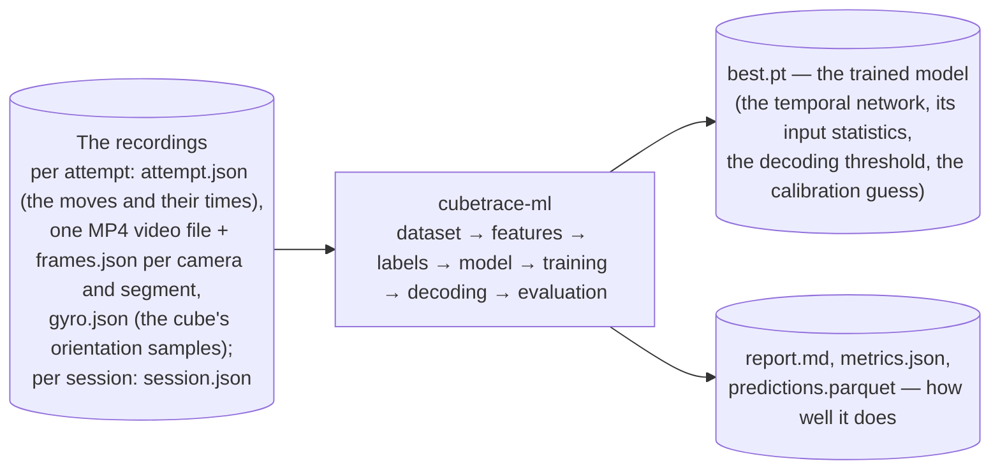
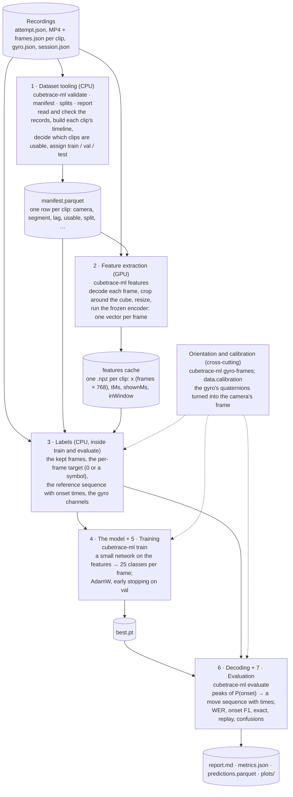
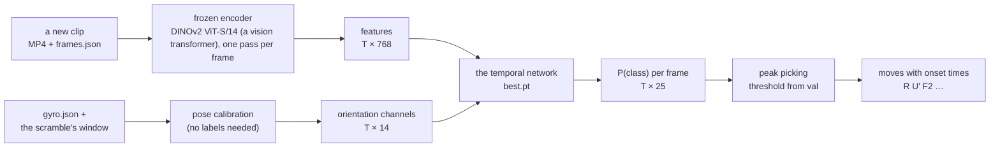

# The cubetrace-ml pipeline, from the top down

This series explains the machine-learning pipeline of this repository to someone who writes software for
a living but is new to machine learning (ML). It starts with the whole pipeline as one box, then descends,
level by level, to the individual modules, classes and functions. Every stage says what goes in and what
comes out. Every external tool is named with a link to its documentation and a line on why it is used.
Every acronym is expanded the first time it appears on a page. ML terms are collected in the
[glossary](glossary.md), each with a link for going deeper.

How to read it: the pages are numbered in the order the data flows. Each page opens with a diagram and an
inputs/outputs table, then takes its components one by one; a component that is itself made of parts
repeats the pattern (diagram, inputs/outputs, parts). The code snippets are excerpts of the real source
(`src/cubetrace_ml/`), trimmed; the "Where in the code" table at the end of each page maps the concepts
back to modules and functions.

| Page | What it covers | Modules |
|---|---|---|
| this page | the pipeline as one box, then as seven stages; the training path and the inference path; what "the model" is | `cli` |
| [01 · The recordings](01-recordings.md) | what the capture app writes, the two clocks, the camera lag, the 24-symbol alphabet | `dataset`, `store`, `records`, `moves`, `align` |
| [02 · The dataset tooling](02-dataset.md) | validation, the per-clip timeline, the consistency filter, the splits, the manifest, the visual checks | `checks`, `filter`, `splits`, `manifest`, `contact_sheet`, `video` |
| [03 · Feature extraction](03-features.md) | the frozen encoder, framing and decoding, the features cache, the GPU (graphics processing unit) batch run | `framing`, `video`, `encoders`, `features` |
| [04 · Labels](04-labels.md) | the kept frames, the per-frame target, the reference sequence, the gyro channels, loading a split | `labels` |
| [05 · The model](05-model.md) | the temporal network: standardization, projection, convolutions, BiGRU (bidirectional gated recurrent unit) or transformer, the head; the two losses | `models`, `config` |
| [06 · Training](06-training.md) | batches, augmentation, the optimizer and schedule, validation, early stopping, checkpoints, the run folder | `train`, `config` |
| [07 · Decoding](07-decoding.md) | from per-frame probabilities to a move sequence with times: peak picking, CTC (connectionist temporal classification), the consistency pass, the baseline | `decode` |
| [08 · Evaluation](08-evaluation.md) | WER (word error rate), onset F1, exact match, replay, confusions; the report, plots and tables | `metrics`, `evaluate`, `report`, `cube` |
| [09 · Orientation and calibration](09-orientation.md) | the gyro's quaternions, the gyro's frame, the calibration into the camera's frame, the four evaluation modes | `orientation`, `gyroframes`, `calibrate` |
| [10 · Infrastructure](10-infrastructure.md) | the repository, `uv` and the extras, CI (continuous integration), the bucket, the GPU machine | `pyproject.toml`, `scripts/gpu/` |
| [Glossary](glossary.md) | every ML term used in the series, with links | – |

## Level 0: the whole pipeline as one box

The problem: a speedcuber solves a Rubik's cube in front of one or two cameras. The Bluetooth cube
reports every turn it feels (`R`, `U'`, `F2`, …) with a timestamp. The goal is a model that, given only the
video (and, since M3, the third task of `docs/PLAN.md`, the cube's orientation sensor), reproduces that sequence of moves with the time
each one started. The cube's own report is the ground truth that the model is trained to imitate; once
the model works, the video alone (or a video from a camera the cube never talked to) can be read back
into moves. In ML terms this is **sequence labelling of a video**: a time series of frames in, a sequence
of discrete events with times out, much like speech recognition turns audio into words.



| | What | Where it lives |
|---|---|---|
| **Input** | the recordings of the capture app ([shermam/cubetrace](https://github.com/shermam/cubetrace)): for every attempt, the move stream with its times, one or two video clips per segment (the scramble and the solve) with the host time of every frame, the gyro's samples; for every session, the cameras and their sync checks. The exact files are on page [01](01-recordings.md). | the bucket `gs://cubetrace-data/users/<uid>/sessions/…`, mirrored to a local folder for work |
| **Output 1** | `best.pt`: a [PyTorch](https://pytorch.org/docs/stable/index.html) checkpoint with the trained temporal network's weights, the input normalization, the resolved configuration, the decoding threshold chosen on validation, the baseline's settings and, for a calibrated run, the calibration record | the run folder `runs/<name>/` (never committed; follow-up (v) of `docs/PLAN.md` is about syncing it to the bucket) |
| **Output 2** | the evaluation on a held-out split: `report.md` (tables), `plots/*.png`, `predictions.parquet` (every clip's predicted sequence), `metrics.json` (every number) | the same run folder |

"The model" is not one file. To read a new clip the system needs three things: the **frozen frame
encoder** (DINOv2, downloaded once from the Hugging Face Hub through timm, never changed by training; page 03), the **temporal
network** in `best.pt` (page 05) and the **decoding rule** with its threshold (page 07). The checkpoint
holds the last two; the first is a public pretrained model that any machine can download.

## Level 1: the seven stages

(CPU: the central processing unit, the ordinary processor; GPU: the graphics processing unit, the
parallel one that neural networks run fast on.)



| Stage | Command | Takes | Gives | Page |
|---|---|---|---|---|
| 1 · Dataset tooling | `validate`, `manifest`, `splits`, `report`, `inspect`, `check-alignment` | the recordings | the manifest (one row per clip with its split and whether it is usable), reports, contact sheets | [02](02-dataset.md) |
| 2 · Feature extraction | `features` (and `bench`, `crop-preview`) | the recordings, the manifest | one `.npz` per clip with a 768-number vector per frame | [03](03-features.md) |
| 3 · Labels | (inside `train` and `evaluate`) | the recordings, the manifest, the features | per clip: the kept frames, the per-frame target, the reference sequence, the gyro channels | [04](04-labels.md) |
| 4 · The model | (inside `train`) | a clip's features (and gyro channels) | 25 numbers per frame: the scores of "no onset" and of the 24 symbols | [05](05-model.md) |
| 5 · Training | `train` | the train and val splits' labels and features | `best.pt`, `last.pt`, `log.csv`, `config.json` | [06](06-training.md) |
| 6 · Decoding | (inside `evaluate`, and inside training's validation) | the model's per-frame probabilities | a sequence of symbols with onset times | [07](07-decoding.md) |
| 7 · Evaluation | `evaluate` | the decoded sequences and the references | `report.md`, `metrics.json`, `predictions.parquet`, the plots | [08](08-evaluation.md) |
| Orientation | `gyro-frames`; `data.inputs`, `data.calibration` | `gyro.json` | the 14 orientation channels in the camera's frame | [09](09-orientation.md) |

The stages are **batch jobs on files**, not a service: each one reads files that the previous one wrote
and writes its own. That is deliberate. The expensive stage (2, the video through the encoder) runs once
on a GPU and is cached; everything after it works on small arrays and runs on an ordinary CPU in an hour or so (about 200 s an epoch on 4 cores),
so a model can be retrained many times without touching the video again. Stage 2 is the only one that
needs a GPU (graphics processing unit: the parallel processor that neural networks run fast on).

### The two paths through the pipeline

**Training** (what has been run so far): every stage above, on the whole dataset, split by recording
session into **train** (the clips the model learns from), **val** (validation: the clips used to choose
settings and to decide when to stop) and **test** (clips the model never sees until the final score; the
number reported is the test number). The split is by session, never by attempt, so that the test clips come
from recordings the model has never seen in any form: scoring on clips from a session the model trained
on would overstate how well it generalizes (the glossary's *data leakage*).

**Inference** (reading a new clip with a trained model), which the evaluation performs on the test split
and which a future app feature would perform live:



T is the number of frames of the clip (about 30 a second). The orientation branch is optional: the model
works on the features alone, and the orientation branch is what fixed the side-face confusions of the
first real runs (page 09).

## The numbers so far

`configs/perframe-bigru.toml` with the overrides `--set data.inputs=features+gyro --set
data.require_gyro=true --set data.calibration=pose` (page 06's command), on the DINOv2 features, trained on three sessions (729 clips with a gyro)
and scored on the two sessions of 2026-10-03 (224 clips, 10,777 moves; `docs/PLAN.md`, "The `pose` run"):

| Metric (test split, pooled) | Value | Meaning (page 08) |
|---|---|---|
| WER (word error rate) | 0.311 | edits per reference move: about 3 wrong, missing or extra moves in 10 |
| onset F1 at ±50 ms, timing / symbol | 0.838 / 0.726 | how many moves are found at the right time; and with the right symbol |
| onset F1 at ±25 ms, timing / symbol | 0.695 / 0.612 | the same at a tighter tolerance |
| right symbol at the matched onsets | 84% | once a move is found at the right time, its symbol is right 84% of the time |

The learning-curve experiment of 2026-10-08 (the model trained on one training session at a time, then on
all three) showed that the model is a model of a camera set-up: the one
training session recorded on the same rig as the test sessions carries almost all of the value, and a
camera never seen in training is not covered. More sessions on the rig are the lever.

## The code map

```
src/cubetrace_ml/
├── cli.py            the `cubetrace-ml` command: one sub-command per stage
├── store.py          where the files are: a local folder or a gs:// prefix with a cache     ─┐
├── records.py        the JSON Schemas and their validation                                   │ page 01
├── dataset.py        listing sessions, attempts and clips; reading the records               │
├── moves.py          the move stream: the clock fit, the 24-symbol alphabet (normalize)      │
├── align.py          one clip on the host clock: frame times, the lag, the per-frame track  ─┘
├── video.py          PyAV: frame counts, frames by index, the FFmpeg filter-graph decode     ─┐
├── checks.py         validate (records vs folders) and check-alignment (frames vs video)     │
├── filter.py         the consistency filter: why a clip is not usable                        │ page 02
├── splits.py         train / val / test by session                                           │
├── manifest.py       the manifest tables and the report                                      │
├── contact_sheet.py  the visual check (inspect)                                             ─┘
├── framing.py        the crop: the record's rectangle or a square around the motion         ─┐
├── encoders.py       the frozen encoders: stub, ResNet-18, DINOv2 ViT-S/14                   │ page 03
├── features.py       the features command: decode, crop, encode, cache                      ─┘
├── labels.py         the kept frames, the targets, the reference, the gyro channels           page 04
├── config.py         the run configuration (TOML + overrides)                               ─┐
├── models.py         MoveModel and the two losses                                            │ page 05
├── train.py          train_run, evaluate_run, the checkpoints                                 page 06
├── decode.py         peak picking, CTC greedy, the consistency pass, the baseline              page 07
├── metrics.py        WER, onset F1, exact, replay, confusions                                ─┐
├── evaluate.py       the threshold, the baseline, every clip scored                          │ page 08
├── report.py         report.md, the plots, predictions.parquet, metrics.json                 │
├── cube.py           the facelet simulator for the replay metric                            ─┘
├── orientation.py    quaternions, rotation matrices, the scramble pose, the calibrated channels ─┐
├── gyroframes.py     the gyro-frames diagnostic                                                  │ page 09
└── calibrate.py      the calibrated inputs, the learnt rotations, the fits (PyTorch)            ─┘
```

Everything the pages state is also stated, more tersely, in `docs/DATA.md` (the rules) and
`docs/PLAN.md` (the decisions and the measured outcomes of each task M0–M4). Where they disagree with this series or with each other, the code is the reference.
